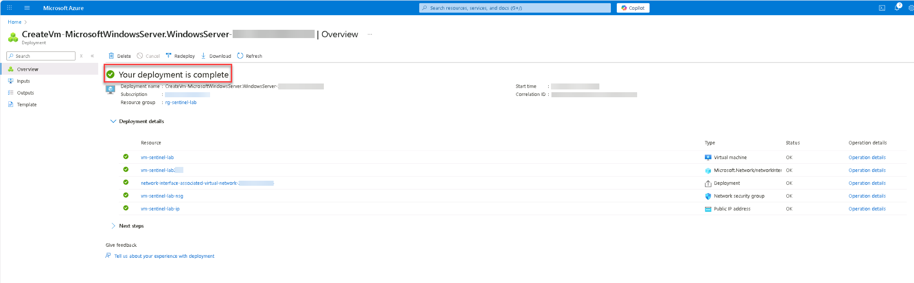
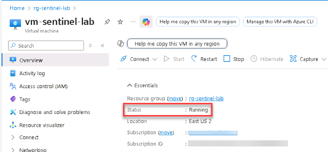
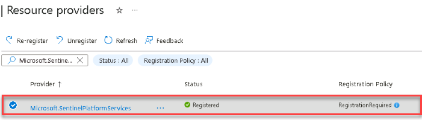

# Task 01: Provision the environment 

 
### Introduction 

Before onboarding Microsoft Sentinel, you must prepare the Azure environment by deploying the foundational components. This includes creating a resource group and a Windows Server virtual machine that will serve as the monitored endpoint. 

### Description 

In this task, you'll create a new resource group, deploy a Windows Server virtual machine, and confirm that the environment is ready for data collection and security monitoring. These resources form the foundation for onboarding Microsoft Sentinel in later exercises. 

### Success criteria 

- The resource group **rg-sentinel-lab** is created in the **East US 2** region.
- A Windows Server virtual machine is deployed in the same resource group.
- The virtual machine is online and accessible in the Azure portal.

1. Open a browser, go to **https://portal.azure.com**, and sign in with your Azure credentials. 

1. Create a resource group named `rg-sentinel-lab` in the `East US 2` region. 

    
  
    
Expand here for detailed steps

    1. Select **Resource groups**, and then select **+ Create**.

    1. On the **Basics** tab, enter the following information:

        | Setting | Value | 
        |----------|--------| 
        | **Subscription** | `Your subscription` | 
        | **Resource group** | `rg-sentinel-lab` | 
        | **Region** | `East US 2`

    1. Select **Review + Create**, and then select **Create**.

    1. Wait for deployment to complete, and verify that the resource group appears in the list.

    
 

1. Deploy a Windows Server virtual machine with the following values: 

    | Setting | Value | 
    |----------|--------| 
    | **Subscription** | `Your subscription` | 
    | **Resource group** | `rg-sentinel-lab` | 
    | **Virtual machine name** | `vm-sentinel-lab` | 
    | **Region** | `East US 2` | 
    | **Availability options** | `No infrastructure redundancy required` | 
    | **Image** | `Windows Server 2022 Datacenter: Azure Edition Hotpatch - x64 Gen2` | 
    | **Size** | `Standard_D2s_v3` | 
    | **Username** | `azureadmin` | 
    | **Password** | `Sentinel@lab.VirtualMachine(Windows11-40-505-19).Password` |
    | **Public IP** | `Selected` | 
    | **Delete public IP and NIC when VM is deleted** | `Selected` |

    
 
    
Expand here for detailed steps

   1. In the Azure portal, select the `rg-sentinel-lab` resource group.

   1. Select **+ Create** and then search for `Virtual Machine`.

   1. On the **Virtual Machine** tile, select **Create** > **Virtual machine**.

   1. On the **Basics** tab, enter the information shown in the table above and then select **Next** until you get to the **Networking** tab.

   1. On the **Networking** tab, ensure a new virtual network is created or select an existing one. Add a Public IP address and enable the **Delete public IP and NIC when VM is deleted** setting.

   1. Keep the default settings for other tabs, and then select **Review + Create**.

   1. Select **Create**, and wait for the deployment to complete.

    

    
 

    {: .important }
    > This VM will serve as the monitored endpoint and will be onboarded into Microsoft Defender for Cloud and Microsoft Defender for Endpoint in later tasks. 

 
1. Verify the virtual machine deployment. 

    
 
    
Expand here for detailed steps
 
    1. In the Azure portal, go to **Resource groups** > **rg-sentinel-lab**.   
    1. Select your virtual machine and verify that the **Status** shows **Running**.

     
    
    
 

1. Register the `Microsoft.SentinelPlatformServices` resource provider.

    
 
    
Expand here for detailed steps

    1. In the Azure portal, search for and select `Subscriptions`.

    1. Select your subscription.

    1. On the left menu, select **Settings** > **Resource providers**.

    1. Search for and choose `Microsoft.SentinelPlatformServices`.

    1. Select **Register** and wait for the registration to complete.

     

    
