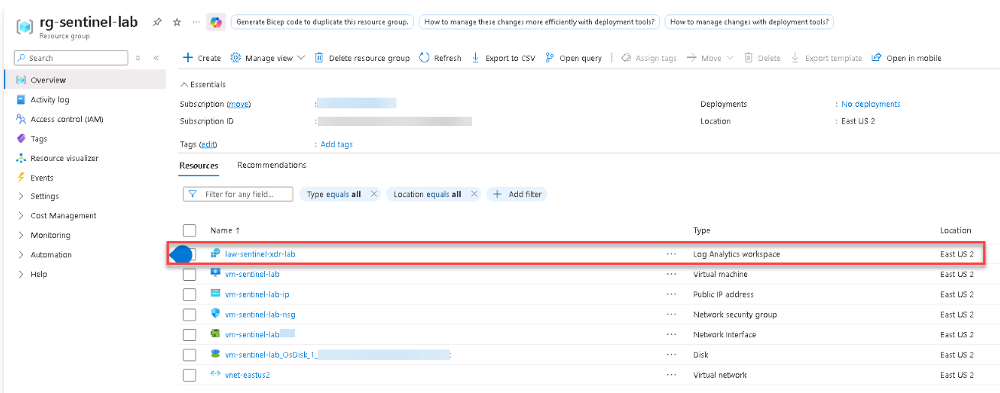

# Task 02: Provision Log Analytics Workspace 

 

### Introduction 

After provisioning the core infrastructure, the next step is to enable telemetry collection so security data can be analyzed in Microsoft Sentinel. You’ll create a Log Analytics workspace (LAW) and a Data Collection Rule (DCR), then associate them with the virtual machine. 

 

### Description 

In this task, you'll configure a Log Analytics workspace to receive telemetry and create a Data Collection Rule to forward data from the Azure VM. This enables Microsoft Defender for Cloud and Microsoft Sentinel to process security events and logs. 

 

### Success criteria 
- A Log Analytics workspace named **law-sentinel-xdr-lab** is created in the **East US 2** region.   
- Data collection from the VM is confirmed through Defender for Cloud. 

1. Create a `Log Analytics workspace` using the following values: 

    | Setting | Value
    |----------|-------
    | **Subscription** | `Your Subscription`
    | **Resource group** | `rg-sentinel-lab`
    | **Name** | `law-sentinel-xdr-lab`
    | **Region** | `East US 2`

    
 
    
Expand here for detailed steps

    1. In the Azure portal, search for and select `Log Analytics workspaces`.

    1. On the Log Analytics workspaces page, select **+ Create**.

    1. On the **Basics** tab, enter the information shown in the table.

    1. Select **Review + create**, and then select **Create**.
    
    1. Wait for the deployment to finish, and verify that the workspace appears in your resource group.

    

    
 

 
{: .important }
> The Log Analytics workspace will be used by Microsoft Defender for Cloud and Microsoft Sentinel to store and analyze collected telemetry. 
