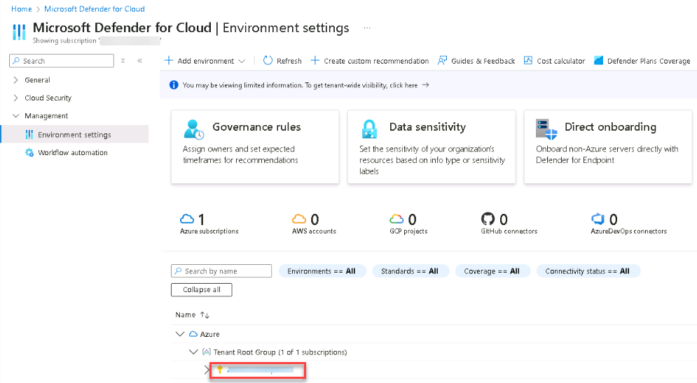
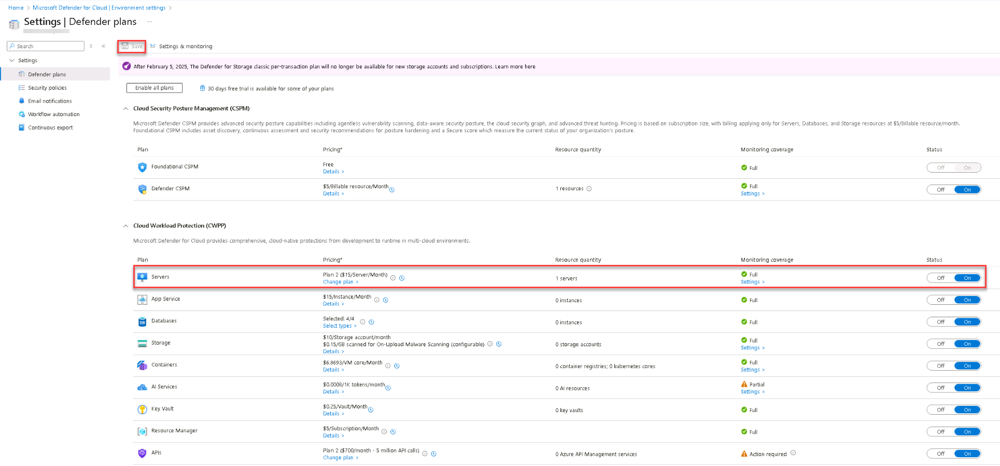

# Task 03: Enable Microsoft Defender for Cloud 

 
### Introduction 

Microsoft Defender for Cloud provides unified security management and advanced threat protection across your Azure resources. Enabling Microsoft Defender for Servers (Plan 2) allows your virtual machine to be automatically onboarded into Microsoft Defender for Endpoint (MDE). 

 
### Description 

In this task, you'll enable Microsoft Defender for Servers (Plan 2) at the subscription level and verify that the Defender agents are automatically provisioned and collecting data from your virtual machine. 

### Success criteria 

- Microsoft Defender for Servers (Plan 2) is enabled for the subscription.
- Auto-provisioning is configured to deploy Defender agents automatically.
- The Azure VM is visible under Defender for Cloud and Defender for Endpoint assets. 

1. In the Azure portal, search for and select `Defender for Cloud`. 

1. Ensure that Defender plans are enabled on the subscripton and that the plan is set to **Microsoft Defender for Servers Plan 2**.  

    
  
    
Expand here for detailed steps

    1. On the **Microsoft Defender for Cloud** page, on the left menu, select **Management** > **Environment settings**, and then expand the Azure tree and select your subscription.

        

    1. On the **Defender plans** page, in the **Cloud Workload Protection (CWPP)** section, locate the **Servers** plan, and ensure the plan is set to **Microsoft Defender for Servers Plan 2**.

    1. If it isn’t enabled, select **Enable all Defender plans**, or toggle **Servers** to **On**.

    1. Select **Save**.

    

    

    {: .note }
    > Plan 2 includes Defender for Endpoint integration, vulnerability assessment, and adaptive application controls. 

1. Configure automatic agent deployment. 

    
  
    
Expand here for detailed steps
 
    
    1. At the top of the **Settings** page, select **Settings & monitoring**.   
    1. In the list of components, locate and turn **On** the following toggles:
        
        - **Log Analytics agent**: Collects security-related configurations and forwards logs to your Log Analytics workspace.
            
            {: .note }
            > Setting may not be available as it is enabled automatically.
               
        - **Endpoint protection**: Enables Microsoft Defender for Endpoint integration, automatically onboarding Azure virtual machines.
       
    1. Select **Save/Continue** at the top of the page.

    1. Select **Save**.

    

{: .warning }
> The **Settings & monitoring** tab replaces the older **Auto-provisioning** blade. Turning on both **Log Analytics agent** and **Endpoint protection** ensures that Defender and monitoring agents are automatically deployed to all existing and future Azure VMs in this subscription. 