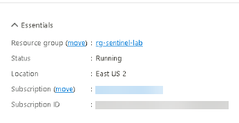
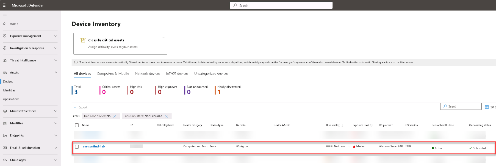
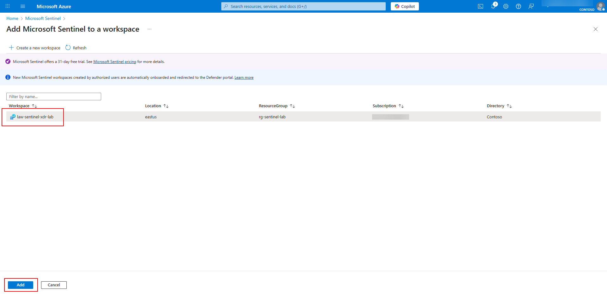
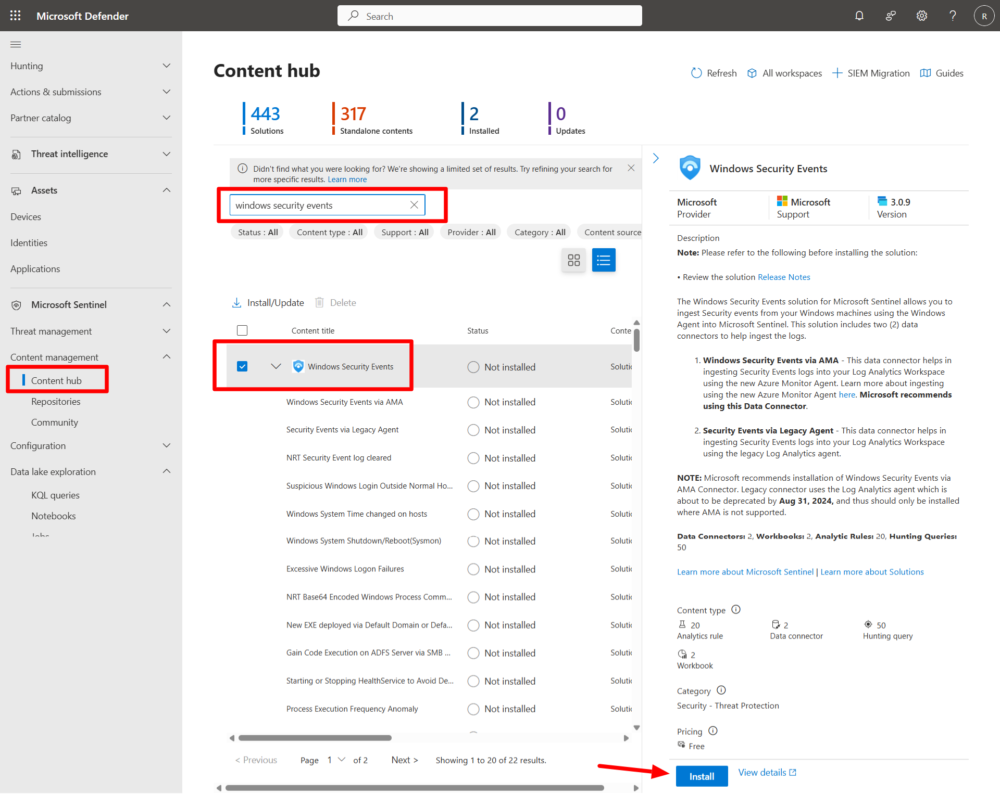
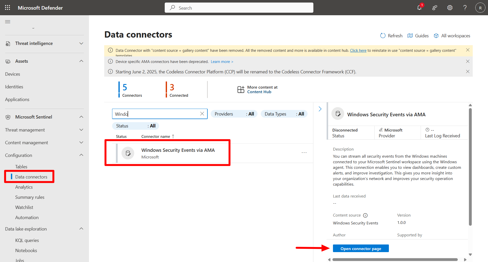
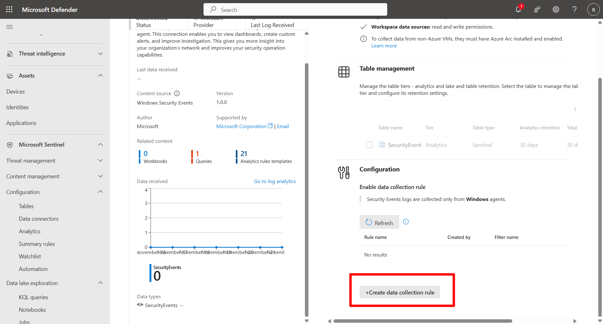
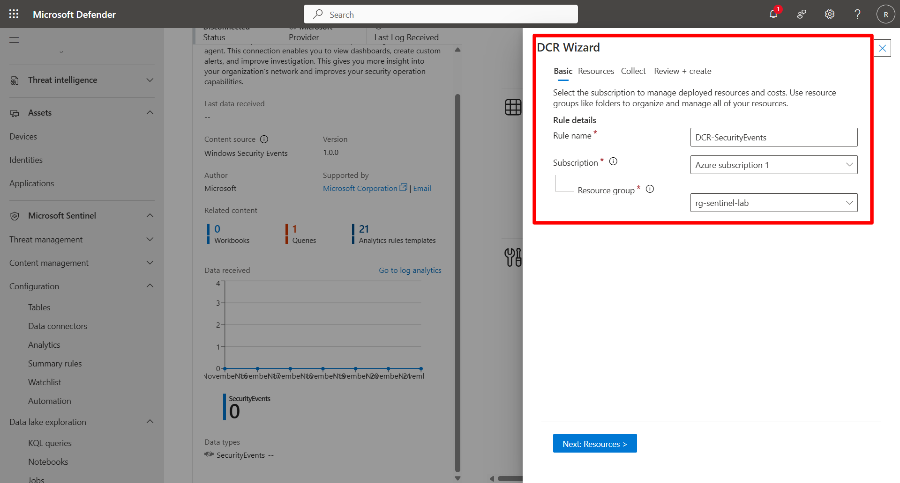
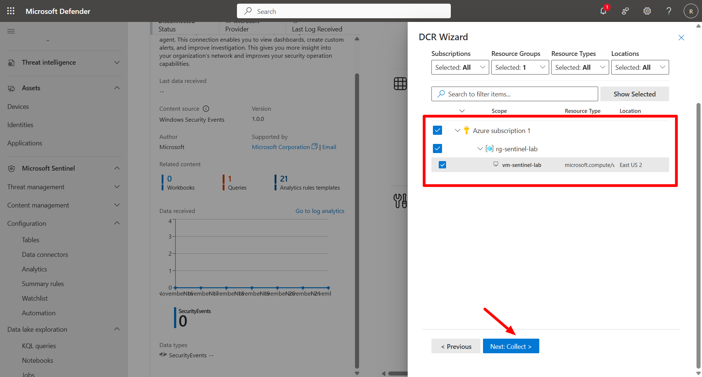
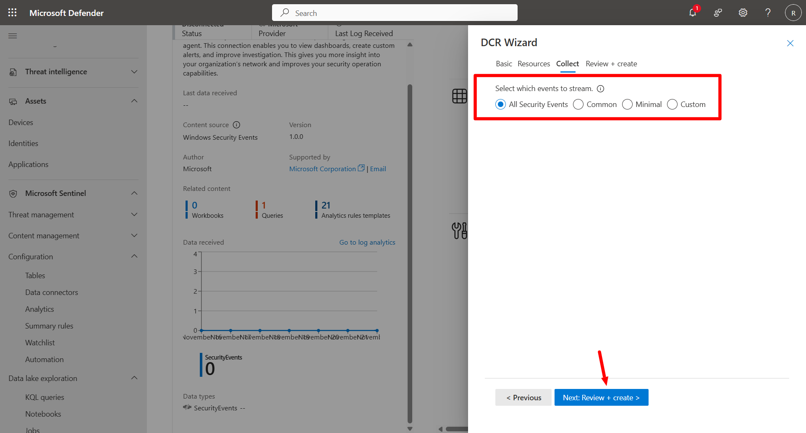
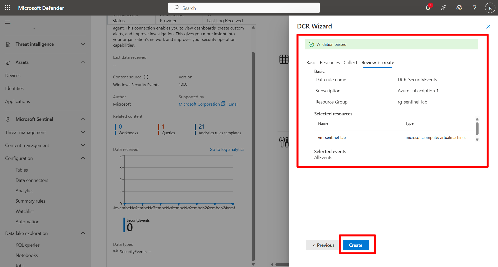

## Task 01: Validate environment and add Microsoft Sentinel 

 
### Introduction 

Before onboarding Microsoft Sentinel, verify that your core environment and resources created in Exercise 0 are active and properly configured. Then, add Microsoft Sentinel to the existing Log Analytics workspace. 

 
### Description 

In this task, you'll confirm the existence of the resource group, workspace, and virtual machine; verify onboarding to Microsoft Defender for Endpoint (MDE); and then attach Microsoft Sentinel to your Log Analytics workspace. 

 
### Success criteria 

- Resource group **rg-sentinel-lab** exists in Azure.   
- Log Analytics workspace **law-sentinel-xdr-lab** is active in **East US 2**.   
- VM **vm-sentinel-lab** appears under **Defender for Endpoint** > **Devices**.   
- Microsoft Sentinel is successfully added to the workspace. 

### Key steps:

1. Verify that your core environment and resources created in Exercise 0 are active and properly configured. 
 

    
  
    
Expand here for detailed steps
 
      1. From the Azure Portal, search for and select `Resource Groups`. 
      
      1. Confirm that the **rg-sentinel-lab** resource group exists.   
      
      1. Open the resource group and ensure **law-sentinel-xdr-lab** is present and in the **East US 2** region.   
      
      1. Select the Windows VM and confirm it’s deployed and running.

          

    
 

 

1. Verify Azure VM onboarding to Defender XDR. 

    
  
    
Expand here for detailed steps
 

    1. Open a new browser tab and go to `https://security.microsoft.com`.   
    1. In the left menu, select **Assets** > **Devices**.   
    1. Confirm that your Azure VM (**vm-sentinel-lab**) appears in the list. 

    {: .highlight }
    > If **Devices** isn’t visible in the menu, go to [https://security.microsoft.com/machines](https://security.microsoft.com/machines).   
    
     

    
 

    {: .warning }
    > Seeing the VM in the Defender portal confirms successful onboarding through Defender for Cloud. 
    >
    > If the VM doesn’t appear immediately, allow several minutes for data to propagate from Defender for Cloud to Defender for Endpoint.
    >
    > If the VM is not onboarded into MDE after 20-30 minutes, restart the VM.  
 

1. Add Microsoft Sentinel to the workspace.   

 
    
  
    
Expand here for detailed steps
 

    1. In the Azure portal, search for and select `Microsoft Sentinel`.
    1. On the **Microsoft Sentinel** page, select **+ Create**. 
    1. On the **Add Microsoft Sentinel to a workspace** page, select your existing workspace **law-sentinel-xdr-lab** from the list.
    1. Select **Add**. 

     

    
 

    {: .important }
    > Once Sentinel is active, it can receive alerts, incidents, and threat intelligence directly from Defender XDR. 

1. Configure Windows Security Event Collection using Sentinel AMA Connector (Content Hub).

    
  
    
Expand here for detailed steps

    
    1. Open a new browser tab, and go to `https://security.microsoft.com/`.
        
        {: .note }
        > If necessary, sign in. 

    1. On the left menu, select **Microsoft Sentinel** > **Content Management** > **Content hub**.
    1. In the search box, search for and select `Windows security events`.

        

    1. Select **Install**.
    1. Once the install completes, go to **Data Connectors**.
    1. Select **Windows Security Events via AMA**.
    1. Select **Open Connector page**.

        

    1. Select **Create data collection rule**.

        

    1. In the wizard, on the Basic page, enter the following and select **Next: Resources >**.  

        | Item | Value |
        |:---------|:---------|
        | Rule name   | `DCR-SecurityEvents`   |
        | Subscription   | Choose your subscription   |
        | Resource group   | **rg-sentinel-lab**   |

        

    1. On the Resources page, expand the subscription and select **vm-sentinel-lab** to associate the Windows VM with the Azure Monitor Agent.

        

    1. Select **Next: Collect**.
    
    1. Choose **All Security Events** and then select **Next: Review + create >**.

        

    1. Review the information and select **Create**.

        

    
