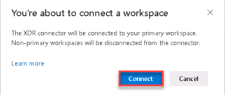
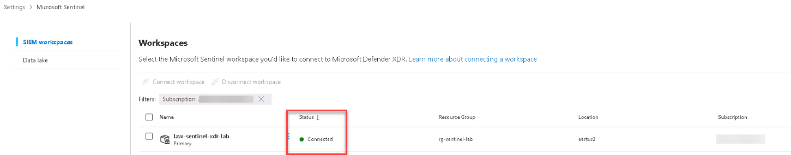
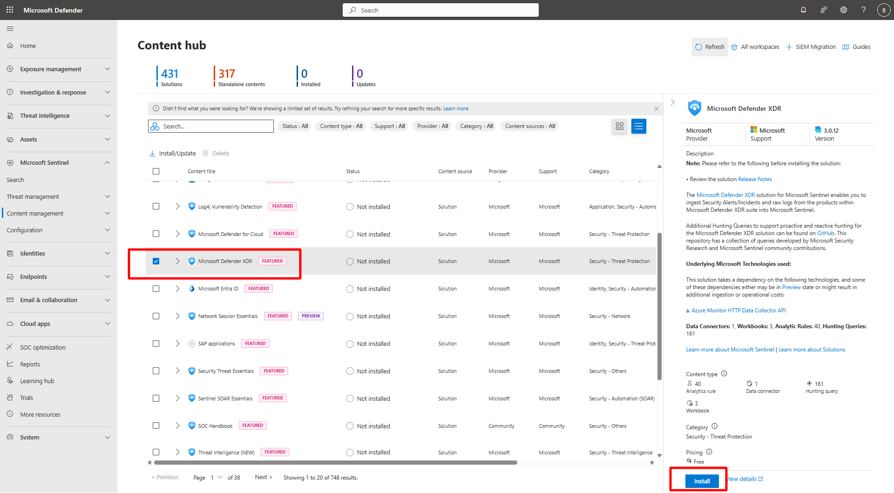

## Task 02: Enable Microsoft Sentinel integration in Defender XDR 

 
### Introduction 

Integrate Defender XDR with your Sentinel workspace so alerts, incidents, and telemetry synchronize automatically between both portals. 

 
### Description 

You’ll connect Defender XDR to the existing workspace and install the Microsoft Defender XDR solution from the Content Hub to enrich Sentinel with prebuilt analytics, workbooks, and schemas. 

 
### Success criteria 

- Defender XDR is connected to **law-sentinel-xdr-lab**.   

- Microsoft Defender XDR solution is installed in Sentinel. 

---

1. In the left menu of the Defender portal, select **System** > **Settings**.

1. On the **Settings** page, select **Microsoft Sentinel**.   

1. Review the integration status for your workspace.   

1. If **law-sentinel-xdr-lab** shows **Connected**, no further action is required.

1. If it shows **No workspace connected** do the following:
    1. Select **Connect workspace**.
    1. Choose **law-sentinel-xdr-lab**, and select **Next**.
    1. Choose **law-sentinel-xdr-lab** as the primary workspace and select **Next**.
    1. Review the workspace information and select **Connect**.
    1. Select **Connect** and wait for the connection to complete.
        
        

    1. Select **Close**.

1. On the SIEM workspaces page, verify that the workspace is connected.
      
    

 

1. Install the Microsoft Defender XDR solution in the Content hub. 

    
  
    
Expand here for detailed steps
 

    1. In the Azure portal, search for and select **Microsoft Sentinel**.

    1. Select **Content management** > **Content hub**.

    1. On the **Content hub** page, in the search box, enter `Microsoft Defender XDR`.

    1. From the results, choose the **Microsoft Defender XDR** box.

    1. In the **Microsoft Defender XDR** flyout, select **Install** to deploy the associated analytics rules, workbooks, and data schemas.
    1. Wait several minutes for installation to complete. 

     

    
 

    {: .note }
    > Installing the solution enriches Sentinel with Defender XDR content such as rules, dashboards, and queries. 

 