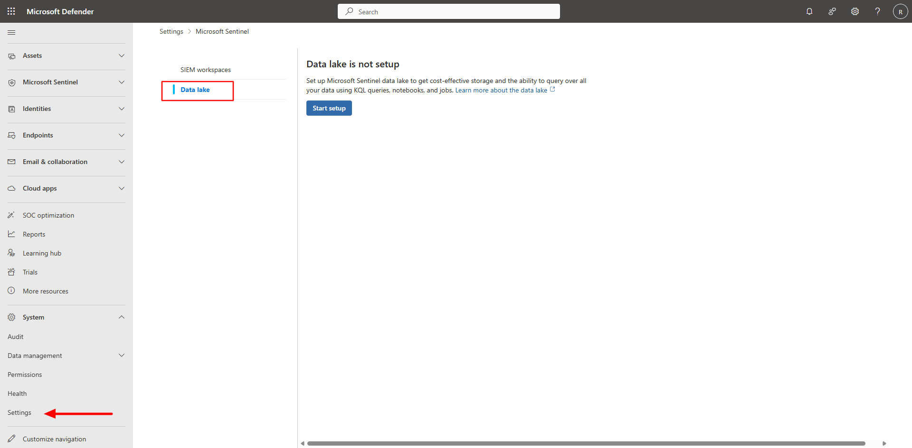
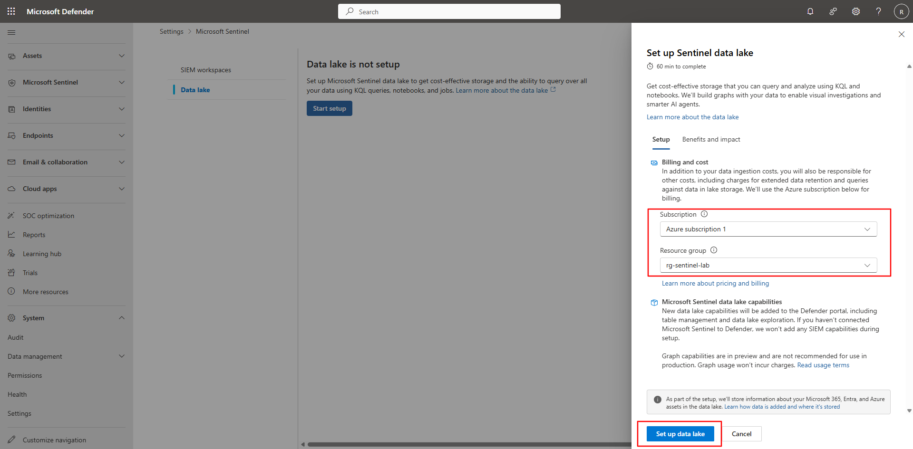
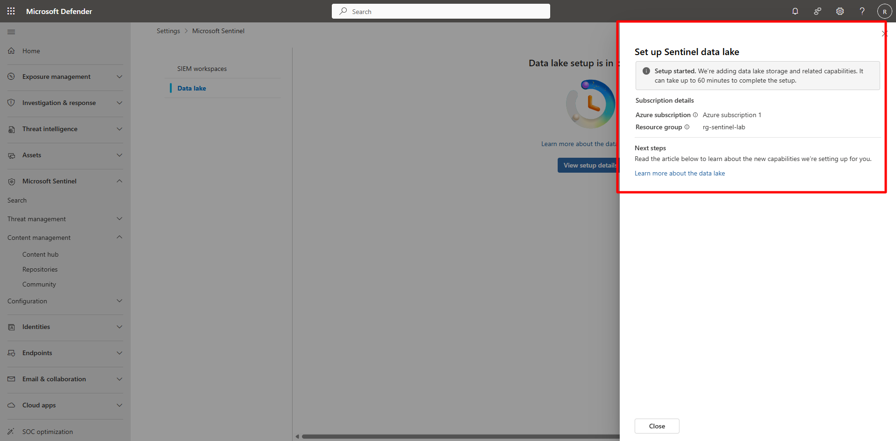

## Task 03: Enable Data Lake integration 

 
### Introduction 

Activate the Sentinel Data Lake feature to persist Defender XDR telemetry beyond the analytics tier and enable long-term data storage. 

### Description 

You’ll use the setup wizard in the Defender portal to provision a Data Lake and link it to the existing Sentinel workspace. 

### Success criteria 

- Data Lake integration is successfully configured for **law-sentinel-xdr-lab**.   

- Provisioning status in the Defender portal shows **Active**. 

### Key steps:

1. In the Defender portal, on the left menu, select **System** > **Settings**. 

1. Select **Microsoft Sentinel** and then on the **Microsoft Sentinel** menu, select **Data Lake**.   

     

1. Select **Start setup** or **Set up Data Lake** to launch the wizard.   

     

1. Select your Azure subscription and resource group, then choose **Set up Data Lake** to begin provisioning.   

     

    {: .warning }
    > Provisioning may take **40–90 minutes**. You can continue with other tasks while setup completes in the background. 
