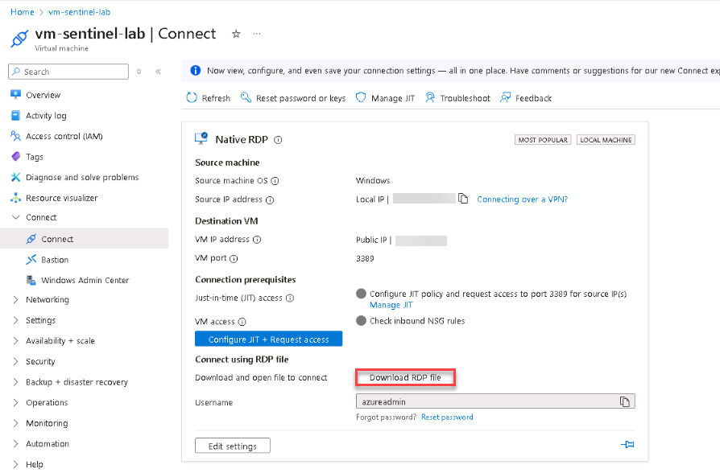
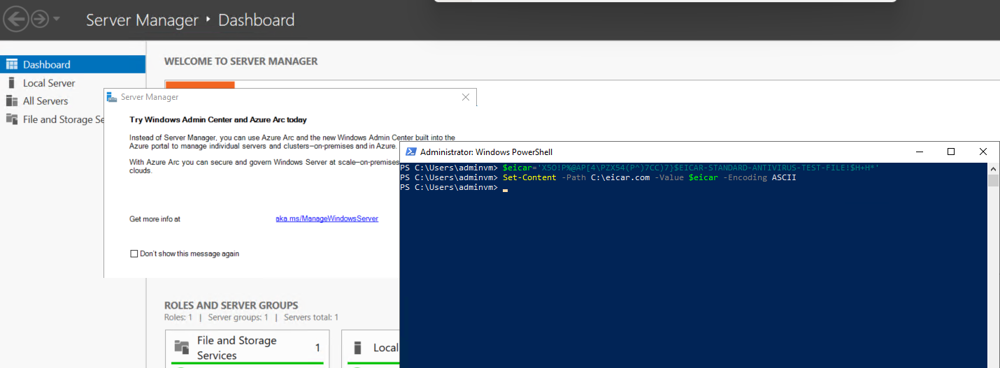
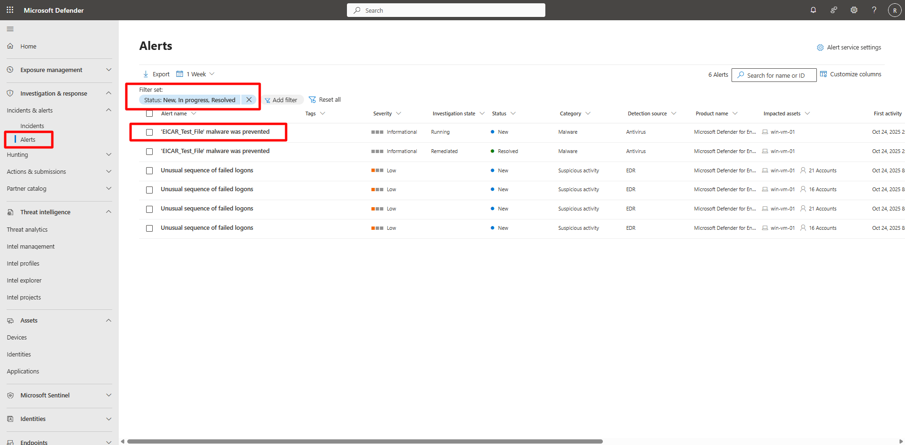
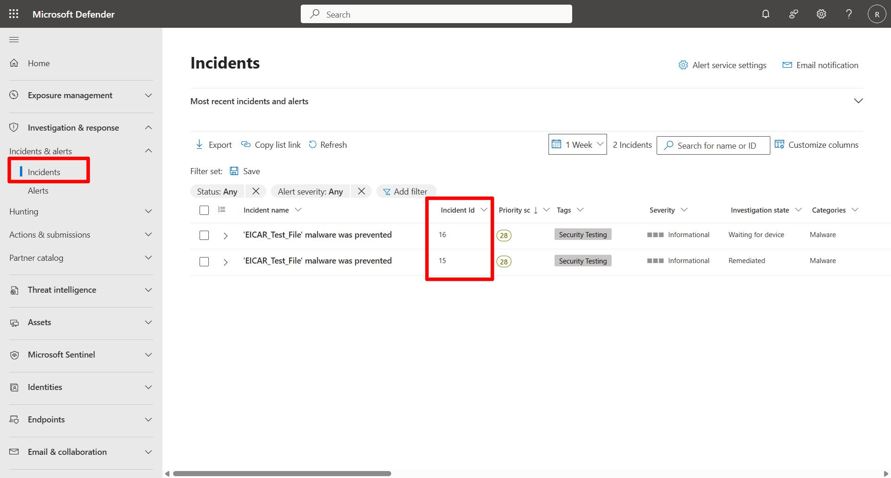
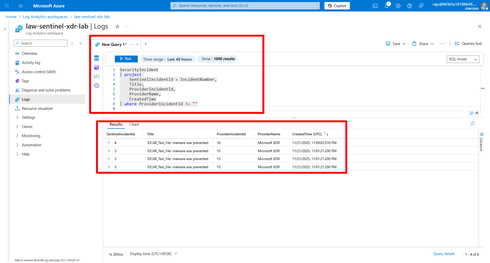
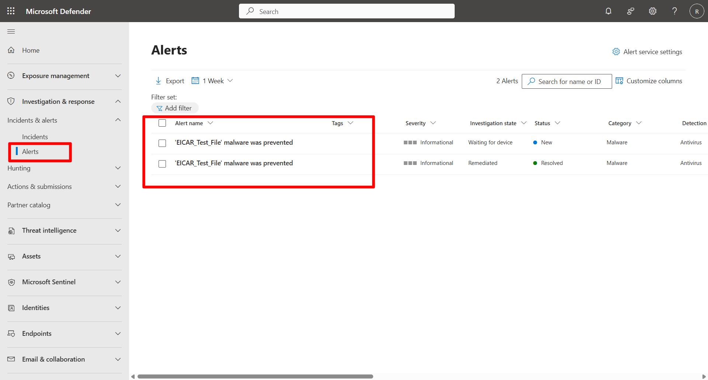

## Task 04: Validate alert and incident flow


### Introduction 

Validate that alerts generated from onboarded endpoints in Microsoft Defender for Endpoint flow into Microsoft Sentinel as unified incidents through Defender XDR integration. 


### Description 

You’ll trigger a safe test alert on the VM, confirm its appearance in Defender XDR, and verify it also appears in Microsoft Sentinel using KQL queries. 

 
### Success criteria 

- A Defender for Endpoint test alert is generated on the VM.   
- The alert appears in both Defender XDR and Sentinel with matching ID and timestamp. 

### Key steps:

1. Connect to the Azure virtual machine (`vm-sentinel-lab`). 

    | Item | Value | 
    |:---------|:---------| 
    | **Username** | `azureadmin` | 
    | **Password** | `Sentinel@lab.VirtualMachine(Windows11-40-505-19).Password` | 

 

    <details markdown="block">  
    <summary>Expand here for detailed steps</summary> 

    1. In the Azure portal, search for and select the `vm-sentinel-lab` virtual machine.   
    1. Select **Connect** and download the RDP file to the default location in the VM. 
    1. Open and run the .rdp file. 
    1. In the Remote Desktop Connection popup, select **Connect**. 
    1. Sign in using the credentials above and connect in spite of any certificate issues. 

     

    </details>  


1. Trigger a Defender test alert on the Azure virtual machine. 
 
    <details markdown="block">  
    <summary>Expand here for detailed steps</summary> 

    1. Open **PowerShell as Administrator**.   
    1. Run the following commands to simulate a malware detection event using the EICAR test file:   

        ```PowerShell7-wrap
        $eicar='X5O!P%@AP[4\PZX54(P^)7CC)7}$EICAR-STANDARD-ANTIVIRUS-TEST-FILE!$H+H*' 
        Set-Content -Path C:\eicar.com -Value $eicar -Encoding ASCII 
        ``` 

    1. Wait a few moments for Microsoft Defender for Endpoint to detect and quarantine the file.
    1. Run the command 4-5 times to get a handful of alerts. 
    1. Minimize the RDP window.  

         

    </details> 

    {: .note }
    > This harmless file triggers an antivirus alert used to test Defender for Endpoint integration. 

 

1. Verify the alert in the Defender portal. 

    <details markdown="block">  
    <summary>Expand here for detailed steps</summary> 

    1. If necessary, minimize the RDP session and return to the browser tab that’s signed into the Defender portal. 
    1. On the left menu, select **Investigation & response** > **Incidents & Alerts** > **Alerts**.   
    1. Confirm a new alert related to **EICAR Test File** or **Malware detected** appears.   
    1. If not visible, wait up to five minutes and refresh the page.   

     

    </details> 

 

1. Verify unified incident visibility between portals. 

    <details markdown="block">  
    <summary>Expand here for detailed steps</summary> 

    1. On the left menu, select **Investigation & response** > **Incidents & Alerts** > **Incidents**.
    1. Open the incident created by the EICAR test.   
    1. Copy the **Incident ID** from the incident details panel into a Notepad for future use.

        {: .warning }
        > Wait 3-5 minutes for results to appear, if results do not appear, move to the next step.

        

        {: .warning }
        > Remove all filters applied to incidents in the Defender portal.

    1. In the Azure portal, go to **Microsoft Sentinel** > **law-sentinel-xdr-lab**. 
    1. On the left menu, select **General** > **Logs**. 
    1. Close the query hub. 
    1. Verify that **KQL mode** is selected.   
    1. Run the following KQL queries:   

        - **Check for Security Incidents**.

            ```kusto-wrap
            SecurityIncident 
            | project  
                SentinelIncidentId = @lab.Variable(incidentid), 
                Title, 
                ProviderIncidentId, 
                ProviderName, 
                CreatedTime 
            | where ProviderIncidentId != ""             
            ```

            

        - **Check for Security Alerts**.

            ```kusto-wrap
            SecurityAlert 
            | where ProviderName == "MDATP" or ProductName == "Microsoft Defender for Endpoint" 
            | project TimeGenerated, AlertName, Description, CompromisedEntity, Tactics, ProviderName 
            | sort by TimeGenerated desc
            ``` 

            

            {: .warning }
            > Remove all filters applied to alerts in the Defender portal.

    </details> 


    {: .important }
    > Matching incident IDs in both portals confirm synchronization and unified visibility between Defender XDR and Sentinel.