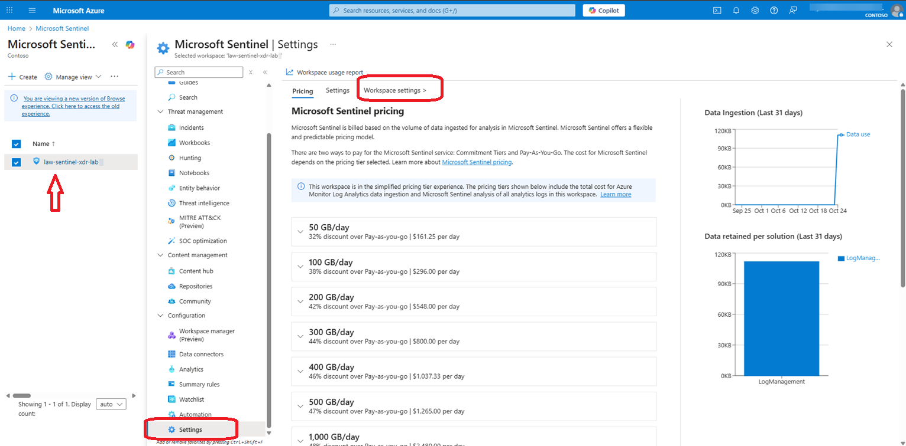
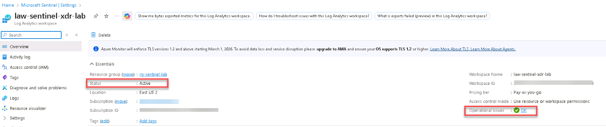
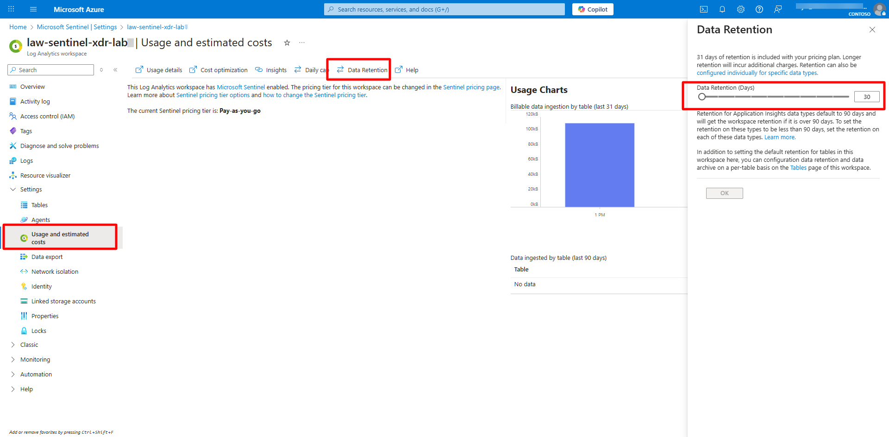
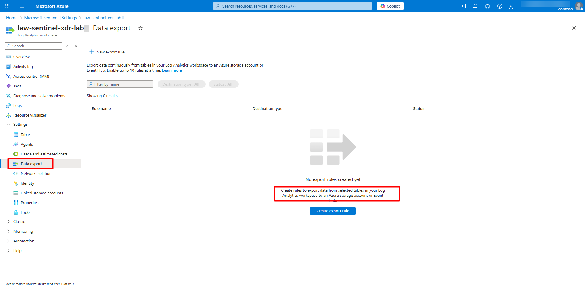
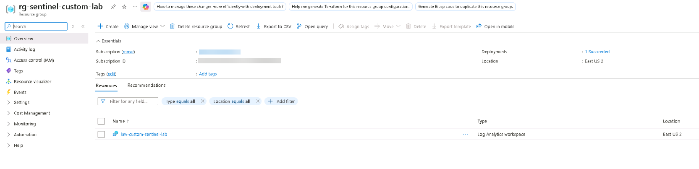

## Task 01: Explore the default workspace and create a custom workspace 

### Introduction 

Every Microsoft Sentinel deployment is built on top of a Log Analytics workspace that stores logs, incidents, and telemetry data. This workspace acts as the analytics hub where data from Defender XDR and other sources is aggregated and normalized. 

 

### Description 

In this task, you'll locate your default workspace, explore its structure and linked resources, and create a new custom workspace to compare workspace configurations. 

 

### Success criteria 

- The default workspace **law-sentinel-xdr-lab** is identified and explored.   
- A new workspace **law-custom-sentinel-lab** is created for comparison.   
- You understand how Sentinel organizes data through workspace hierarchies and linked services. 

### Key steps:

1. In the Azure portal, confirm Sentinel is active for this workspace.   

 
    
  
    
Expand here for detailed steps
 
     
    1. On the left menu of the workspace, select **Configuration** > **Settings**. 
    1. On the **Settings** page, near the top, select **Workspace settings >**. 

         

    1. Verify that the status is **Active** and that there are no **Operational issues**.

         

    
 

    {: .important }
    > The default workspace acts as your primary analytics hub. All alerts, incidents, and rules are scoped within this workspace unless additional ones are configured. 

 

1. Explore workspace features. 

    
  
    
Expand here for detailed steps
 

    1. In the Azure portal, search for and select `Log Analytics workspaces`.   
    1. Select your Sentinel workspace **law-sentinel-xdr-lab** to open its **Overview** page.   
    1. Review the following key details:   
        - **Workspace ID** — Unique analytics identifier for your workspace.   
        - **Location** — Where log data is physically stored and queried.   
    1. From the left menu, expand **Settings** and review: 
        - **Usage and estimated costs** > **Data retention** — Verify or adjust how long logs are retained (default: **30 days**).
               
        - **Data export** — Review or create data export rules to continuously export selected tables from your Log Analytics workspace to a storage account or Event Hub for long-term retention or external analytics.
               
    1. Close the workspace blade and return to Microsoft Sentinel when finished reviewing. 

    
 

 

1. Create a custom log analytics workspace using the following for comparison:

    | Setting | Value | 
    |----------|--------| 
    | **Subscription** | `Your subscription` | 
    | **Resource group** | *Create new* > `rg-sentinel-custom-lab` | 
    | **Workspace name** | `law-custom-sentinel-lab` | 
    | **Region** | `East US 2` (same as default workspace) |

 
    
  
    
Expand here for detailed steps
 

    1. In the Azure portal, search for `Log Analytics workspaces`, and then select **+ Create**.   
    1. Create a new workspace using the values from the table.
    1. Select **Review + Create**, and then select **Create**.
        
        

    1. After the deployment completes, open **Microsoft Sentinel**.
    1. Select **Create**, select the new workspace **law-custom-sentinel-lab**. 
    1. Select **Add**.  
    
     

    
 

{: .note }
> The new workspace starts empty — no data connectors, rules, or logs until configured. 