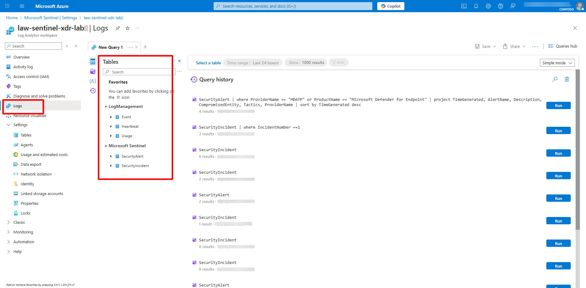

## Task 02: Explore tables, schemas, and data sources 

 
### Introduction 

Microsoft Sentinel organizes collected data into tables stored within your workspace. Each table corresponds to a data source such as Defender XDR, Entra ID, or Azure Activity.   

Understanding how these tables are structured helps you build effective queries and detections. 

 

### Description 

In this task, you'll explore the table structure inside your workspace and run basic Kusto Query Language (KQL) queries to view sample data. 

 ### Success criteria 

- Key tables (SecurityIncident, SecurityAlert, SigninLogs, AuditLogs) are identified.
- Schema and data structure are reviewed.
- Queries successfully return relevant security data. 

### Key steps:

1. Locate and review these Sentinel workspace key tables:   

    - **SecurityIncident** — Incident-level data aggregated from Defender XDR and Sentinel rules.   

    - **SecurityAlert** — Alert-level data from Defender XDR, Sentinel analytics rules, and integrated sources.   

    - **SigninLogs** — Authentication events from Entra ID.   

    - **AuditLogs** — Administrative or configuration actions. 

 

    <details markdown="block">  
    <summary>Expand here for detailed steps</summary>     
    1. Open your default Sentinel workspace (`law-sentinel-xdr-lab`).   
    1. In the left menu, select **Logs**. 
    1. Close the Query hub, if necessary.  
    1. Expand the **Tables** icon in the left pane to view all table categories.   

     

    </details> 

 
    {: .highlight } Each data connector adds its own set of tables. Knowing which table maps to which connector helps target your KQL queries effectively. 

 

1. Run exploratory KQL queries to inspect data and schemas. 

    {: .warning } Remember from the **Logs** page, in the upper right, verify that **KQL mode** is selected. 

    1. **List all tables and row counts**. 

        <details markdown="block">  
        <summary>Expand here for detailed steps</summary> 
        1. Run the following:

            ```kusto-wrap
            search * | summarize Rows = count() by $table| sort by Rows desc 
            ```

        </details> 

 

    1. **Inspect schema for a specific table (example: SecurityAlert)**. 

        <details markdown="block">  
        <summary>Expand here for detailed steps</summary>
        1. Run the following:

            ```kusto-wrap
            SecurityAlert 
            | getschema 
            ```

        </details> 

 

    1. **Review the latest incidents**. 

        <details markdown="block">  
        <summary>Expand here for detailed steps</summary>
        1. Run the following:

            ```kusto-wrap
            SecurityIncident | sort by TimeGenerated desc| take 10 
            ```

        </details> 

 

    1. **Filter incidents related to EICAR test**. 

        <details markdown="block">  
        <summary>Expand here for detailed steps</summary>
        1. Run the following:

            ```kusto-wrap
            SecurityIncident| where Title contains "EICAR" or Description contains "EICAR"| project TimeGenerated, IncidentNumber, Title, Severity, ProviderName, Owner| sort by TimeGenerated desc 
            ```

        </details> 

 

    1. **View Defender for Endpoint alerts**. 

        <details markdown="block">  
        <summary>Expand here for detailed steps</summary>
        1. Run the following:

            ```kusto-wrap
            SecurityAlert| where ProviderName == "MDATP" or ProductName == "Microsoft Defender for Endpoint"| where TimeGenerated > ago(48h)| project TimeGenerated, AlertName, Description, CompromisedEntity, Tactics, ProviderName| sort by TimeGenerated desc 
            ```

        </details>     

 

    1. **Analyze recent sign-in activity (if Entra ID connector is active)**. 

        <details markdown="block">  
        <summary>Expand here for detailed steps</summary> 
        1. Run the following:

            ```kusto-wrap
            SigninLogs| summarize SignIns = count() by AppDisplayName, ResultType| top 10 by SignIns desc 
            ``` 

        </details> 

 
{: .warning } Some queries may return no results if connectors like Entra ID are not yet configured. 
