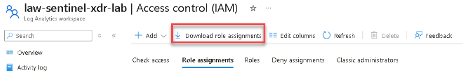
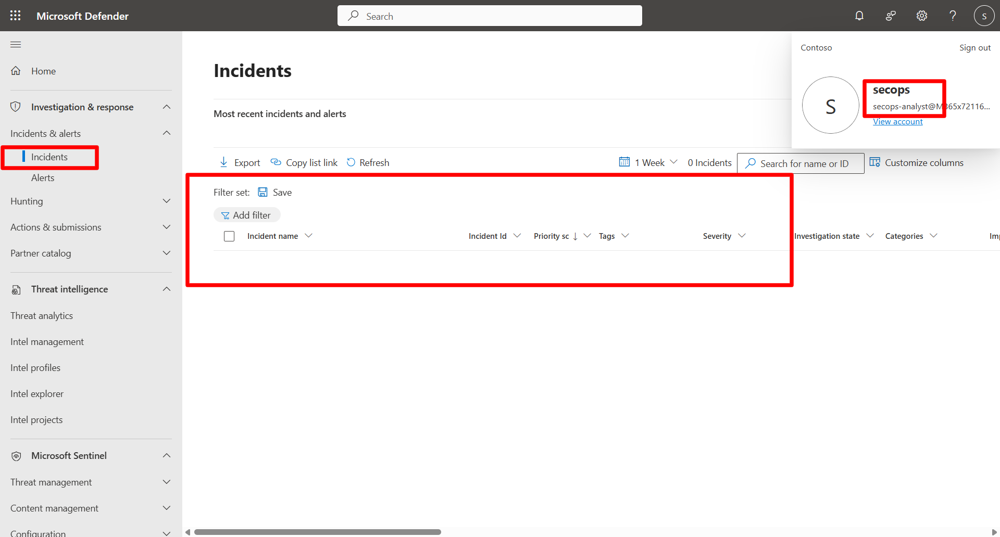

## Task 03: Manage access and collaboration 

 
### Introduction 

Microsoft Sentinel supports role-based access control (RBAC) to enable secure collaboration across teams.   

In this task, you'll review existing workspace roles, assign a new role to a test user, and validate access in the Defender portal. 

 

### Description 

You’ll explore workspace IAM settings, add a contributor role to a test account, and confirm access permissions through the Defender portal. 

 

### Success criteria 

- Existing workspace role assignments are reviewed.   
- A test user is granted the Microsoft Sentinel Contributor role.   
- Access validation confirms proper visibility in the Defender portal. 

### Key steps:

1. On the left menu of your Sentinel workspace (**law-sentinel-xdr-lab**), select **Access control (IAM)**.

1. On the **Role assignments** tab, review the list of users, groups, and service principals who already have access.

    {: .important }
    > If you’d like to export the current list, you can use the **Download role assignments (.csv)** link at the top of the page. This step is optional and for reference only.   
    > 
    >  

 

    {: .warning }
    > If your lab environment does not include a secondary user account, review the remaining steps conceptually.   
    > 
    > You can create a test user under **Microsoft Entra ID** > **Users** > **+ New user** and then complete the steps to complete Exercise 2. 

 
3. Assign the `Microsoft Sentinel Contributor` role to a test user.   

    
  
    
Expand here for detailed steps
 

    1. In **IAM**, select **+ Add** > **Add role assignment**.   
    1. Search for and select `Microsoft Sentinel Contributor` and then select **Next**. 
    1. Choose **User, group, or service principal**. 
    1. Select **+ Select members**.   
    1. Search for and select your lab test account (for example, `secops-analyst@contoso.com`) and then select **Select**. 
    1. Select **Review + Assign**.   
    1. Wait about one minute, then refresh the **Role assignments** tab to confirm the addition. 

    
 

4. Validate access in the Defender portal. 

    
  
    
Expand here for detailed steps
 

    1. Open an **InPrivate** or different browser session and go to `https://security.microsoft.com`.   
    1. Sign in as the user assigned in the previous step.
    1. In the Defender portal, go to **Microsoft Sentinel** > **Workspaces**.   
    1. Confirm the user can see the Sentinel Workspace (**law-sentinel-xdr-lab**)  
        
        {: .important }
        > The user will not see the previously generated EICAR incident because it originated from Defender for Endpoint, and the user does not have Defender XDR permissions (Security Reader/Operator/Admin).

        
    
    
 