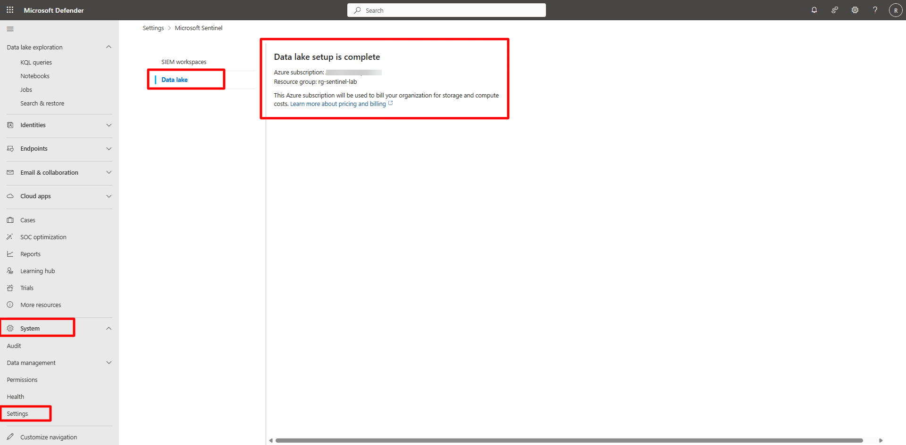

## Task 01: Pre-check — Verify Sentinel Data Lake integration 

 
### Introduction 

Before validating or querying data, confirm that your Data Lake provisioning is complete and bound to the correct Azure subscription and resource group. 

 
### Description 

You’ll verify that the Data Lake setup in the Defender portal is complete and ready to receive replicated data from Defender XDR. 

### Success criteria 

- The Sentinel workspace **law-sentinel-xdr-lab** is linked to a valid Data Lake.
- The Data Lake shows status **Setup complete** in the Defender portal. 

### Key steps:

1. In the Defender portal, on the left menu, expand **System** > **Settings** and then select **Microsoft Sentinel**. 

1. On the **Microsoft Sentinel** pane, select **Data Lake**.   

1. Confirm that the Data Lake setup is complete and associated with your Azure subscription and resource group (for example, **rg-sentinel-lab**).   

1. Verify that the provisioning status shows **Completed**.   

 

{: .warning }
> Provisioning typically takes **40–90 minutes**. The Data Lake is created at the tenant level and automatically binds to your Sentinel workspace for mirroring Defender XDR and Sentinel analytics data. 
> 
>  
<!-- > 
You may see this as well: 
> 
!  -->