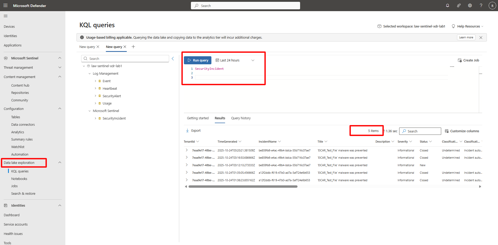
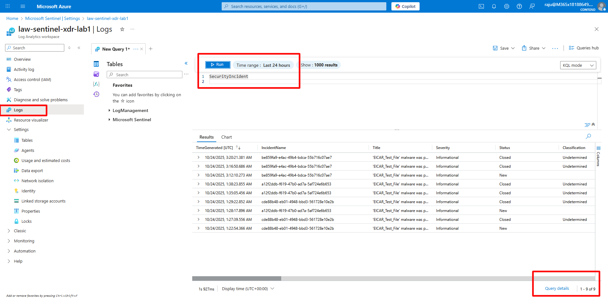

## Task 02: Validate Data Lake integration with Defender XDR 

 
### Introduction 

After onboarding, new telemetry and incidents generated in Defender XDR are automatically replicated into the Sentinel Data Lake.   

This task verifies that replication is functioning correctly and that data remains queryable. 

 
### Description 

You’ll query the Data Lake to confirm that new alerts and incidents from Defender XDR are mirrored successfully. 


### Success criteria 

- KQL queries in the Data Lake return recent incidents and alerts.   

- Results match recent Defender XDR telemetry. 

 
{: .note } The Data Lake only mirrors **new** data ingested after onboarding. Historical data is not replicated. 

 

1. In the Defender portal, on the left menu, select **Microsoft Sentinel** > **Data Lake Exploration** > **KQL Queries**.   

1. Run the following queries to validate mirrored data. 

 

    <details markdown="block">  
    <summary>Expand here for detailed steps</summary> 

    - **Query 1 — Security Incidents** 

        ```kusto-wrap
        SecurityIncident 
        | where TimeGenerated > ago(48h) 
        | summarize Count = count() by ProviderName, Severity, Status 
        | sort by Count desc 
        ``` 

    

    - **Query 2 — Security Alerts from Defender XDR** 

        ```kusto-wrap
        SecurityAlert 
        | where TimeGenerated > ago(48h) 
        | summarize Count = count() by ProductName, AlertSeverity 
        | sort by Count desc 
        ``` 

        <!-- 

          -->

        {: .note }If no data appears, generate new incidents and alerts by completing **Exercise 1 > Task 04**, then wait **5–15 minutes** for ingestion to reflect in the Data Lake.

        {: .important }Queries against Log Analytics may return additional historical results since the Data Lake begins replication only after activation. 

         

    </details> 