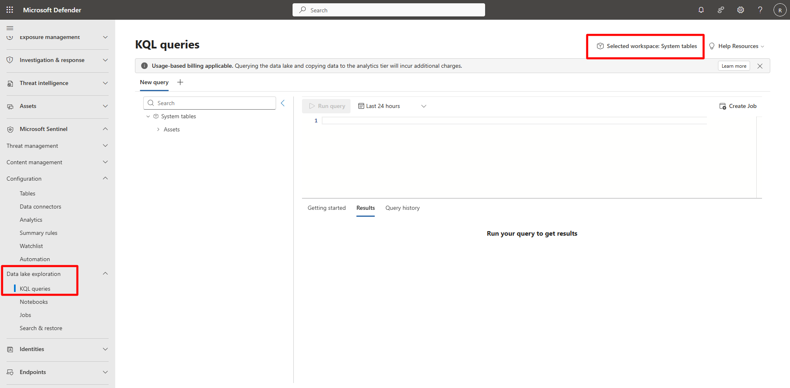
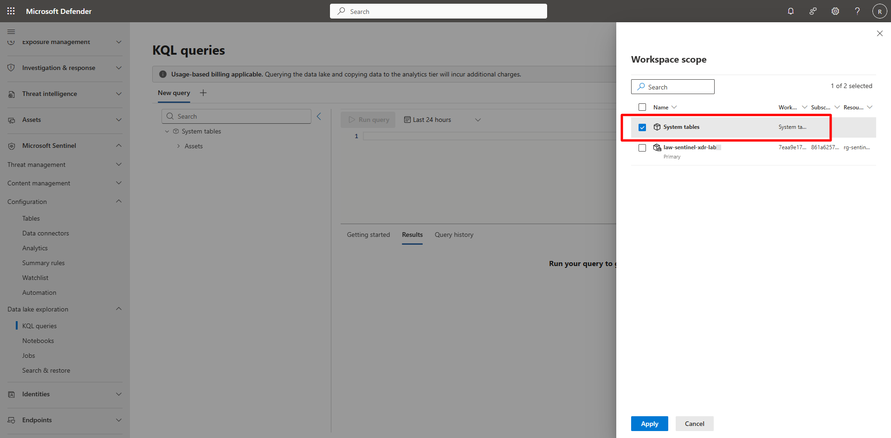
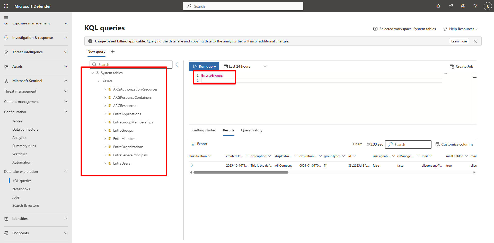

## Task 03: Verify availability of system tables and Lake integration 

### Introduction 

Microsoft Sentinel’s Data Lake includes **system tables**—tenant-level datasets managed by Microsoft, containing Defender XDR, Entra ID, and M365 Defender telemetry. 

 

### Description 

You’ll verify that these system tables are accessible within the Data Lake and understand their role in unified investigations. 

 

### Success criteria 

- System tables are visible in the Data Lake Exploration view.   
- The **System tables** scope is selectable in the workspace.   
- You can identify categories such as EntraApplications, EntraGroups, and ARGResources. 

### Key steps:
 

1. Review system tables in Data Lake. 

 
    
  
    
Expand here for detailed steps
 

    1. In the Microsoft Defender portal, go to **Microsoft Sentinel** > **Data Lake Exploration** > **KQL queries**.   
    1. In the upper right of the KQL queries page, select **Selected workspace:law-sentinel-xdr-lab** to view the workspace scope.   
    
        

    1. You should see two scope options: 
        - **law-sentinel-xdr-lab** (Analytics workspace)   
        - **System tables** (tenant-level Data Lake)

    1. Clear **law-sentinel-xdr-lab**, choose **System tables**, and then select **Apply**. 
    
       
         

    1. Expand the table tree on the left.   

        You should see folders such as: 
        - **Assets** > **EntraApplications**, **EntraGroups**, **EntraMembers** > **ARGResources, ARGAuthorizationResources**, and others.   

         

        {: .note }
        > System tables in Microsoft Sentinel Data Lake are Microsoft-managed.   
        > You don’t manage their underlying storage or assign RBAC roles directly to them. 
    
    
 
