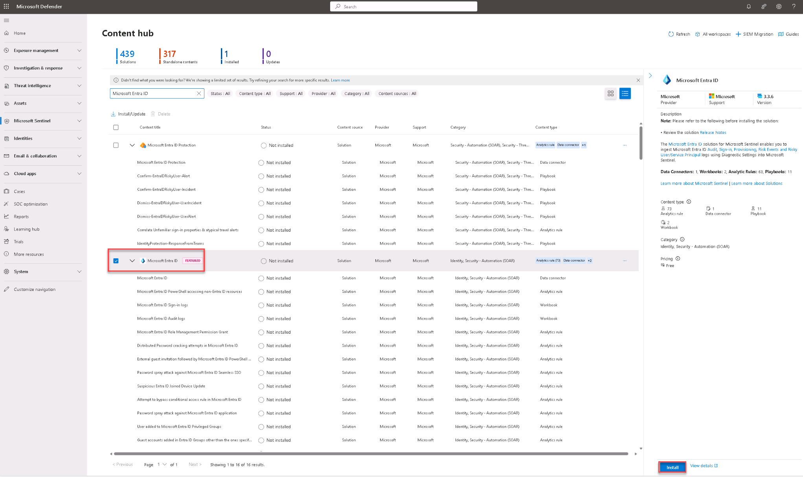
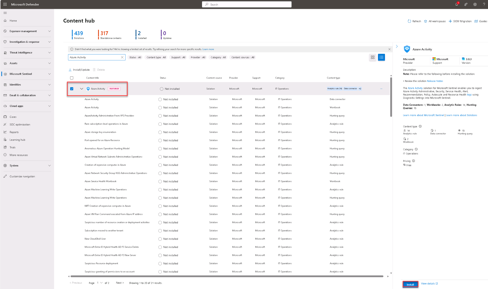
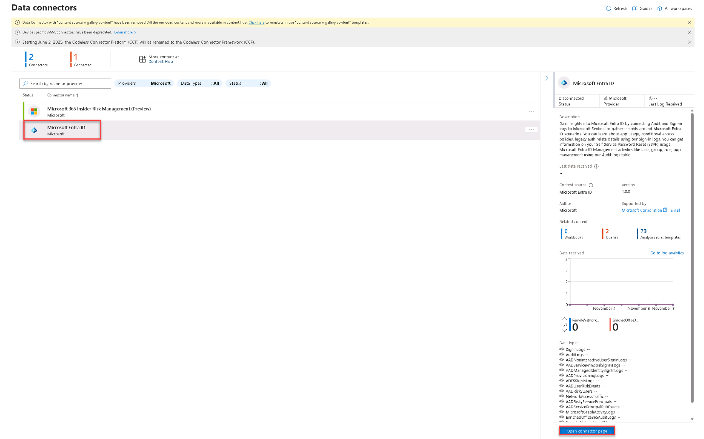
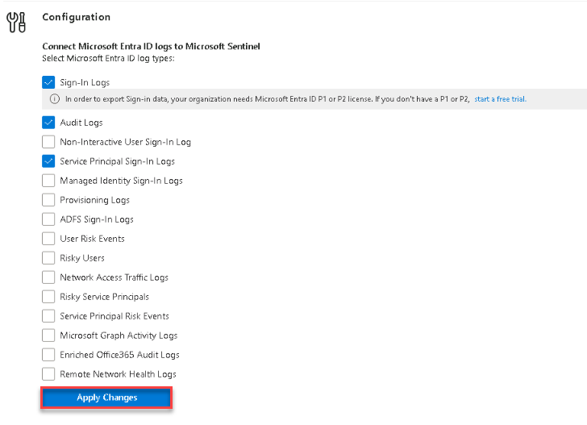
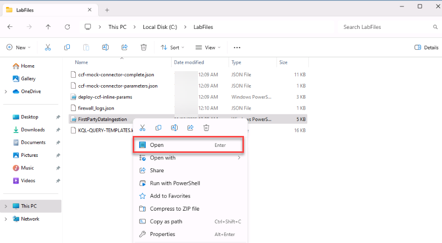
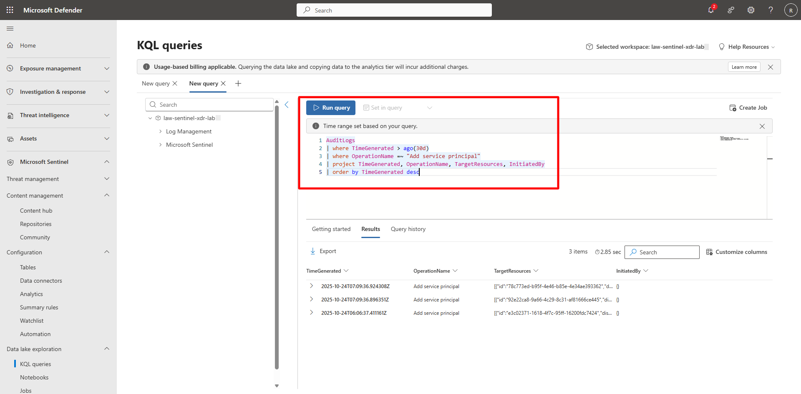

## Task 01: Configure First-Party (1P) data ingestion to the Data Lake 


### Introduction 

Defender XDR and Entra ID data can be mirrored automatically into the Data Lake.   

This task enables those connectors and validates ingestion. 


### Description 

You’ll install the Microsoft Entra ID solution, connect Audit and Sign-in logs, simulate service principal activity, and verify results in KQL. 

 

### Success criteria 

- Entra ID and Azure Activity connectors installed.   
- Audit and Sign-in logs streaming into Sentinel and the Data Lake.   
- New service principal activity visible in queries. 


### Key steps:


1. In the Defender portal, go to **Microsoft Sentinel** > **Content management** > **Content hub**. 

 
1. Search for and choose `Microsoft Entra ID`, on the flyout, select **Install**.   

    

1. Wait until the solution status shows **Installed**. 

    {: .note }
    > This installs the connector, workbooks, and analytic rules. 

1. Repeat the same process to install the `Azure Activity` solution.   

     

1. Open and configure the Entra ID connector.   

    <details markdown="block">  
    <summary>Expand here for detailed steps</summary> 

    1. In the Defender portal, go to **Microsoft Sentinel** > **Configuration** > **Data connectors**.
    
    1. Select **Microsoft Entra ID** and in the flyout, select **Open connector page**.

        

    1. Under **Configuration**, enable **Service Principal Sign-In Logs**, **Audit Logs**, and **Sign-in Logs**.
    
    1. Select **Apply changes** or **Connect** if not already connected.

         

    </details> 


1. Generate synthetic data for validation.

    <details markdown="block">  
    <summary>Expand here for detailed steps</summary>

    {: .note }
    > If you work with multiple Azure tenants or subscriptions, verify that you are signed in to the correct tenant and have the intended subscription selected before running any PowerShell commands. This helps prevent commands from being executed in the wrong environment.

    1. On the Virtual machine taskbar, open File Explorer and go to `C:\LabFiles`.

    1. Right-click **FirstPartyDataIngestion** and select **Open** to open the file in Notepad.

        

    1. Go to line 9, insert your subscription ID and then save the file.

    1. On the taskbar, open an Administrator PowerShell 7 terminal and enter the following to change directories and execute the file:

        ```PowerShell7-wrap
        cd C:\LabFiles
        .\FirstPartyDataIngestion.ps1
        ```

    1. When prompted, open a new browser tab, follow the instructions to authenticate and then return to the terminal. 

    1. Verify that the script completed successfully.

    </details>

1. Validate data with KQL queries.   

 
    <details markdown="block">  
    <summary>Expand here for detailed steps</summary> 

    1. In the Defender portal, on the left menu, go to **Microsoft Sentinel** > **Data Lake Exploration** > **KQL Queries**. 

    1. In the upper right of the KQL queries page, change the workspace scope to **law-sentinel-xdr-lab** and select **Apply**. 

    1. Execute the following query to verify that a new service principal was created:

        **Query 1 – New service principals created**

        
        ```kusto-wrap
        AuditLogs
        | where TimeGenerated > ago(30d)
        | where OperationName =~ "Add service principal"
        | project TimeGenerated, OperationName, TargetResources, InitiatedBy
        | order by TimeGenerated desc
        ```

    1. If data does not appear:
        
        1. Check if the AuditLogs table exists in your Log Analytics workspace. Some workspaces may not have the AuditLogs table enabled, depending on your data connectors and tenant configuration.

        1. If AuditLogs is missing, query the SigninLogs table. During the synthetic data generation step, you created a new service principal and also signed in to the Azure portal.
        
        1. These sign-in events are captured in SigninLogs, so you should see entries related to your activity. Run the following fallback query:
        
        ```kusto-wrap
        SigninLogs
        | where TimeGenerated > ago(30d)
        ```

    <!-- 1. Enter the following to validate the AuditLogs data: 

        ```kusto-wrap
        AuditLogs 
        | where TimeGenerated > ago(30d) 
        | where OperationName =~ "Add service principal" 
        | project TimeGenerated, OperationName, TargetResources, InitiatedBy 
        | order by TimeGenerated desc 
        ``` 

        {: .note }Results may take several minutes to appear. Move to the next step and come back later in the lab.
        >
        

    1. Enter the following to validate the SigninLogs data:

        ```kusto-wrap
        SigninLogs 
        | where TimeGenerated > ago(30d) 
        | where OperationName =~ "Add service principal" 
        | project TimeGenerated, OperationName, TargetResources, InitiatedBy 
        | order by TimeGenerated desc 
        ``` 

    </details>  -->

{: .warning }
> If no results appear, allow **5–15 minutes** for data propagation to the Data Lake and come back to retry the query.
