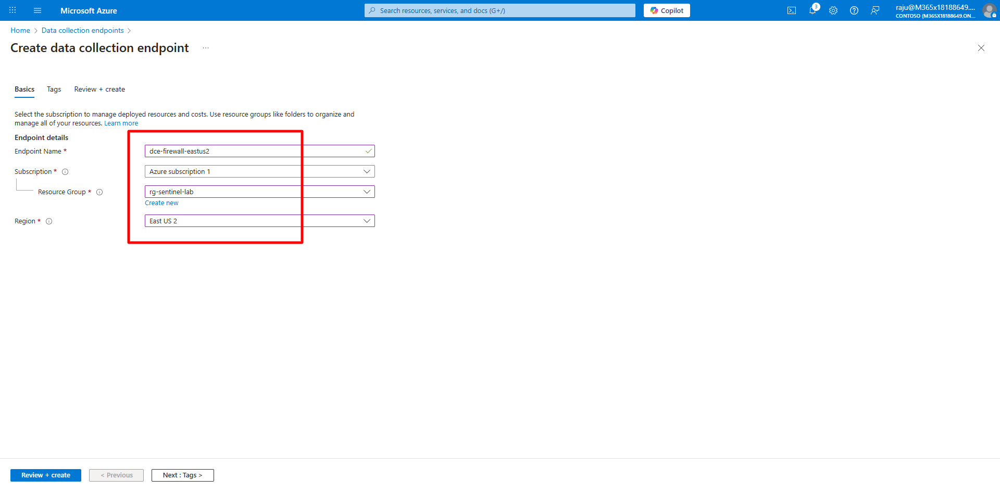
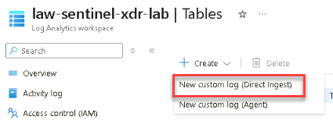
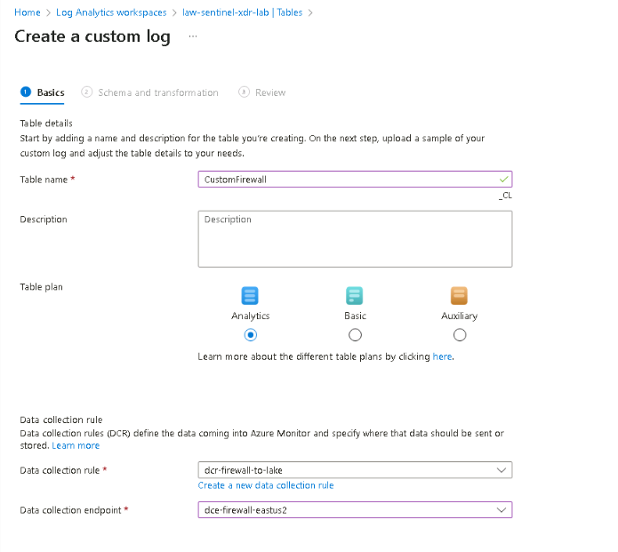
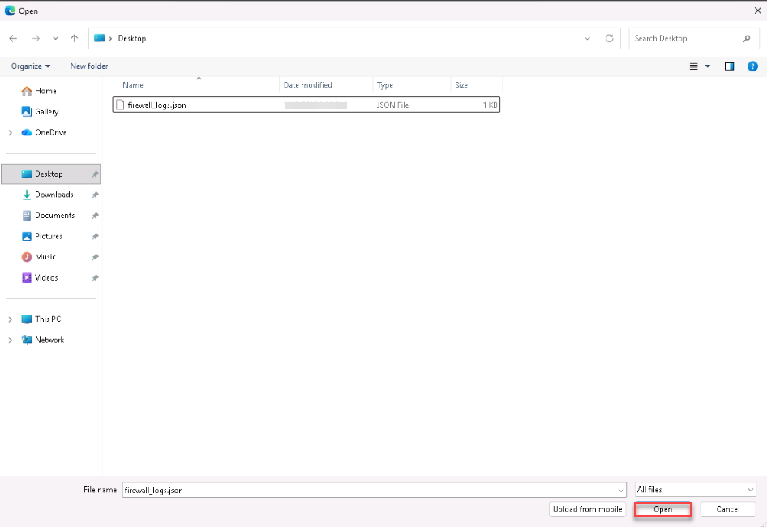
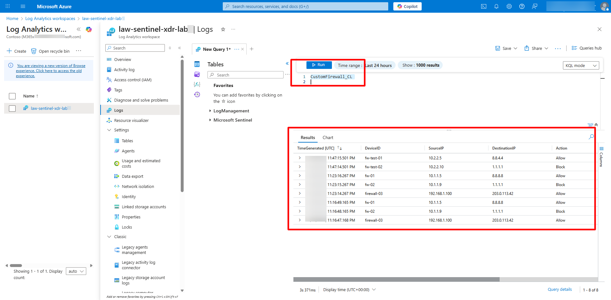
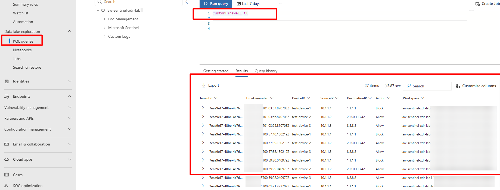

## Task 02: Ingest Third-Party (3P) or custom logs using DCR 

 
### Introduction 

You can onboard third-party logs (such as firewall or IoT data) into the Data Lake using Data Collection Endpoints (DCE) and Data Collection Rules (DCR). 

 

### Description 

You’ll create a sample custom log, build a custom table, and ingest the data through the Logs Ingestion API. 

 

### Success criteria 

- Custom table (**CustomFirewall_CL**) created and receiving data.   

- Data visible in both Sentinel and the Data Lake. 

### Key steps:

1. Open Notepad and save the following JSON as `firewall_logs.json` on the virtual machine Desktop. 

 
    ```firewall_logs.json-wrap
    [ 
      { 
        "TimeGenerated": "2025-10-17T10:15:00Z", 
        "DeviceID": "fw01", 
        "SourceIP": "10.1.1.5", 
        "DestinationIP": "8.8.8.8", 
        "Action": "Allow" 
      }, 
      { 
        "TimeGenerated": "2025-10-17T10:16:00Z", 
        "DeviceID": "fw02", 
        "SourceIP": "10.1.1.9", 
        "DestinationIP": "1.1.1.1", 
        "Action": "Block" 
      } 
    ] 
    ``` 

1. Create a Data Collection Endpoint (DCE) named `dce-firewall-eastus2`.   

    <details markdown="block">  
    <summary>Expand here for detailed steps</summary> 

    1. In the Azure portal, search for and select `Monitor`. 
    1. On the left menu, select **Settings**, then select **Data Collection Endpoints**. 
    1. Select **+ Create** and enter the following values:   

        | Setting | Value | 
        |----------|--------| 
        | **Name** | `dce-firewall-eastus2` | 
        | **Subscription** | `Your Subscription` | 
        | **Resource group** | `rg-sentinel-lab` | 
        | **Region** | `East US 2` | 

    1. Select **Review + Create**, then select **Create**. 

         

    </details> 


1. Create a custom table named `CustomFirewall` and a DCR named `dcr-firewall-to-lake`. 

    <details markdown="block">  
    <summary>Expand here for detailed steps</summary> 

    1. In the Azure portal, search for and select `Log Analytics workspaces`, and then select **law-sentinel-xdr-lab**.   
    1. On the left menu, select **Settings**, then select **Tables**.   
    1. Select **+ Create**, then select **Create a custom log (Direct Ingest)**.

        

    1. On the **Basics** tab, enter the following details:   

        | Field | Value | 
        |--------|--------| 
        | **Table name** | `CustomFirewall` | 
        | **Description** | (optional) Enter a short description | 
        | **Table plan** | Select **Analytics** | 
        | **Data collection rule** | Select **Create a new data collection rule** and name it `dcr-firewall-to-lake` | 
        | **Data collection endpoint** | `dce-firewall-eastus2` |

         

    1. Select **Next**.   
    1. Locate the `firewall_logs.json` file on the Desktop and select **Open**.

        

    1. Review the schema mapping and select **Next**.   
    1. On the **Review + Create** tab, select **Create** to finish table creation.  

    </details> 

 
 

1. Validate and push test data using the Logs Ingestion API. 

    <details markdown="block">  
    <summary>Expand here for detailed steps</summary> 

    1. On the lab virtual machine, open PowerShell 7 as an administrator.    
    1. Go to the lab files directory: 

        ```PowerShell7-wrap
        cd "C:\LabFiles" 
        ``` 

    1. Run the validation and ingestion script: 

        ```PowerShell7-wrap
        .\CustomLogIngestion.ps1 -WorkspaceName "law-sentinel-xdr-lab" 
        ``` 

    1. The script will: 
        - Verify your **Log Analytics workspace**, **Data Collection Endpoint (DCE)**, and **Data Collection Rule (DCR)**.   
        - Ensure transformation rules are correctly configured.   
        - Create or reuse a **service principal** and assign required permissions.   
        - Generate sample test data and ingest it into the **CustomFirewall_CL** table.   
        - Validate that records are indexed in **Log Analytics**. 

    1. When the process completes, verify a summary similar to the following appears: 

        ``` 
        ✓ SUCCESS! Found 3 records in the table 
        ✓ DCR Transformation: source 
        ✓ Test Data Ingestion: Success (HTTP 204) 
        ``` 

    </details> 

 

    {: .note }
    > The `CustomLogIngestion.ps1` script is preinstalled in your lab VM under `C:\LabFiles`. 
    >   
    > This script automates ingestion testing using the Azure Logs Ingestion API, ensuring that your `CustomFirewall_CL` table, DCR (`dcr-firewall-to-lake`), and DCE (`dce-firewall-eastus2`) are correctly configured before proceeding. 

 

1. Validate data ingestion in Microsoft Sentinel. 

 
    <details markdown="block">  
    <summary>Expand here for detailed steps</summary> 

    1. In the Sentinel portal, open your workspace **law-sentinel-xdr-lab**.   
    1. On the left menu, select **General**, then select **Logs**. 
    1. Close the Queries hub.   
    1. Run the following query to view the ingested data: 

        ```kusto-wrap
        CustomFirewall_CL 
        ``` 

    1. Verify that records appear in the query results. 
    
        

    </details> 

 

1. Validate replication in the Sentinel Data Lake. 

    <details markdown="block">  
    <summary>Expand here for detailed steps</summary> 

    {: .warning }
    > Replication can take **10–25 minutes**. 

    1. In the Defender portal, go to **Microsoft Sentinel** > **Data Lake Exploration** > **KQL Queries**.
    
    1. Run the same query to confirm the data has replicated into the Lake: 

        ```kusto-wrap
        CustomFirewall_CL 
        ``` 

    1. Change the date range to 7 days due to UTC format date time.
    
    1. Verify that records appear in the Lake query results. 
    
       

    </details> 
