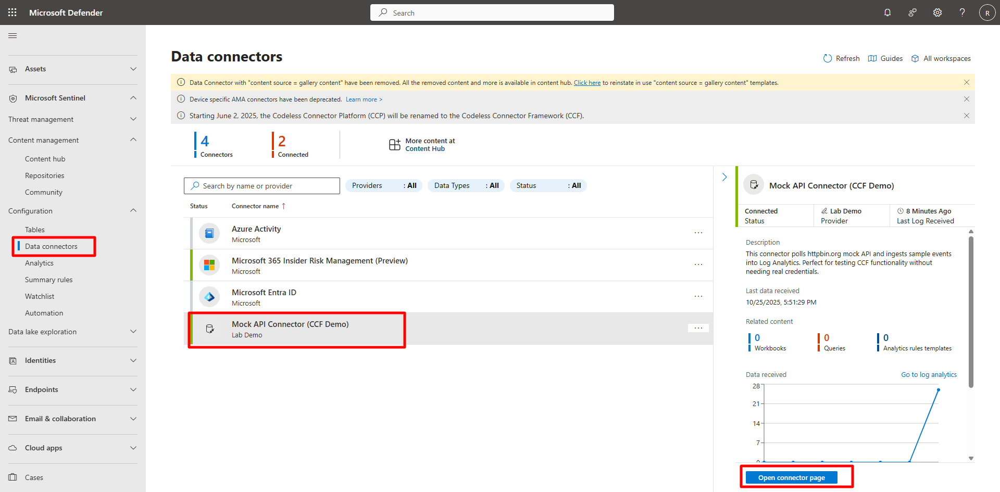
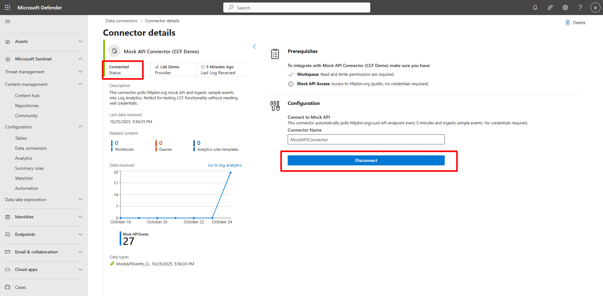
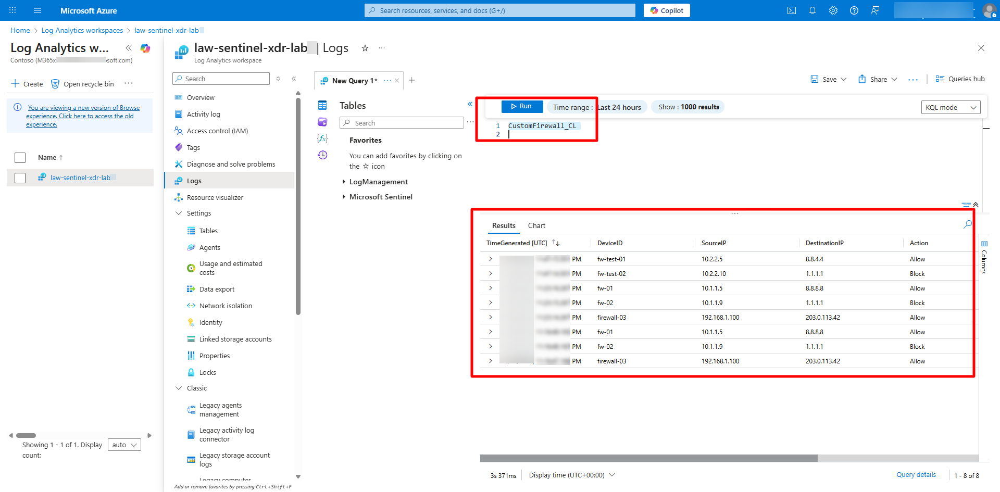
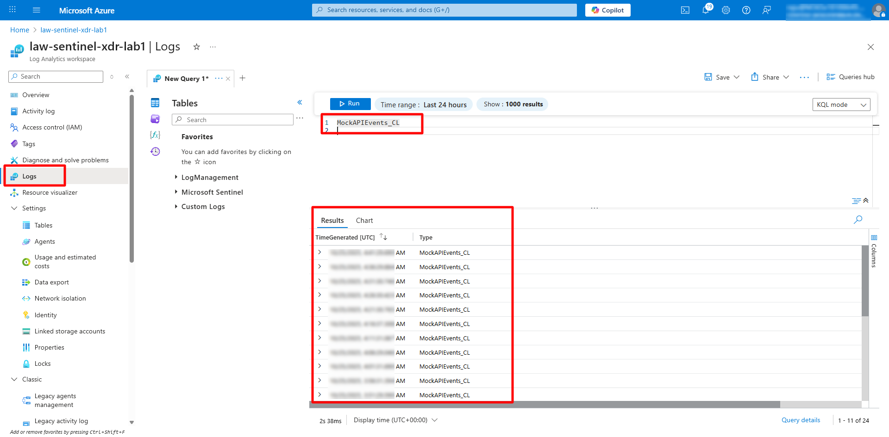

## Task 03: Deploy a Codeless Connector (CCF) using PowerShell and ARM Template 

 
### Introduction 

The Codeless Connector Framework (CCF) simplifies data ingestion by deploying a connector that automatically creates a **Data Collection Endpoint (DCE)**, **Data Collection Rule (DCR)**, and **custom table**. 

 

### Description 

In this task, you’ll deploy a mock API connector using PowerShell and verify data flow into both Microsoft Sentinel and the Data Lake. 

 

### Success criteria 

- The CCF connector is deployed and connected.   

- Mock data appears in both Microsoft Sentinel and the Data Lake. 


### Key steps:

1. Deploy the template using PowerShell. 


    <details markdown="block">  
    <summary>Expand here for detailed steps</summary>

    {: .note }
    > If you work with multiple Azure tenants or subscriptions, verify that you are signed in to the correct tenant and have the intended subscription selected before running any PowerShell commands. This helps prevent commands from being executed in the wrong environment. 

    1. Open Notepad, copy and paste the following command:   

        ```Notepad-wrap
        .\deploy-ccf-inline-params.ps1 -SubscriptionId "<<ReplaceWithSubscriptionId>>" -ResourceGroupName "rg-sentinel-lab" -WorkspaceName "law-sentinel-xdr-lab" -Location "East US 2" 
        ``` 

    1. Replace the subscription placeholder value with your subscription. 
    1. Open PowerShell 7 as an administrator and enter `cd C:\LabFiles`. 
    1. Copy and paste the code from the Notepad editor into the PowerShell 7 terminal and execute it. 

        {: .warning }
        > If you get an error just rerun the script until it’s successful. 

    </details> 

 

1. Verify the connector in Microsoft Sentinel.   

    <details markdown="block">  
    <summary>Expand here for detailed steps</summary> 

    1. In the Defender portal, go to **Microsoft Sentinel** and on the left menu, select **Configuration**, then select **Data connectors**.   
    1. Search for and select `Mock API Connector (CCF Demo)`. 
    1. Select **Open connector page**.   

         

    1. Confirm the connector status shows **Connected**.   
        - If not connected, select **Connect** under **Configuration**. 

         

    </details> 

 

1. Monitor data ingestion.

    <details markdown="block">  
    <summary>Expand here for detailed steps</summary> 

    1. In the Microsoft Sentinel portal, open **Logs**.   
    1. Run the following KQL query to validate that mock API data is flowing in: 

        ```kusto-wrap
        MockAPIEvents_CL 
        ``` 

         

        {: .warning }
        > Replication can take **10–25 minutes**.

    </details> 

 

1. Validate mirrored data in the Data Lake after approximately **10–25 minutes**.   

 

    <details markdown="block">  
    <summary>Expand here for detailed steps</summary> 

    {: .warning }
    > Replication can take **10–25 minutes**. 

    1. In the Defender portal, go to **Microsoft Sentinel** > **Data Lake Exploration** > **KQL Queries**.   
    1. Run the same query to confirm that data is now replicated: 

        ```kusto-wrap
        MockAPIEvents_CL 
        ``` 

         

    </details> 