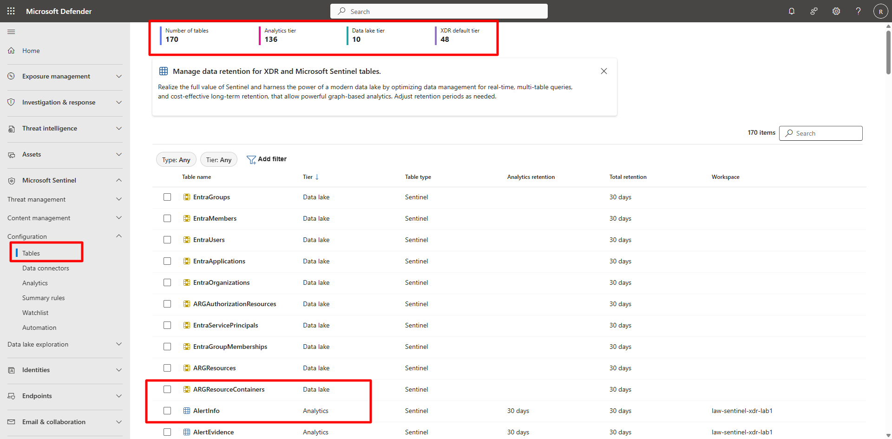
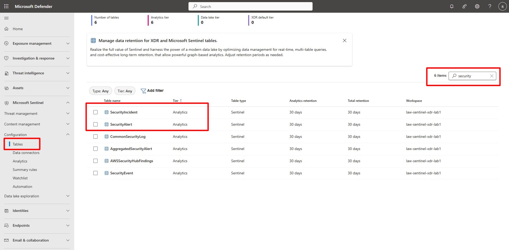
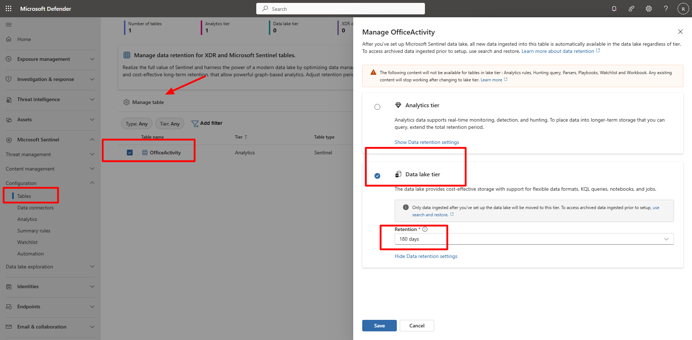
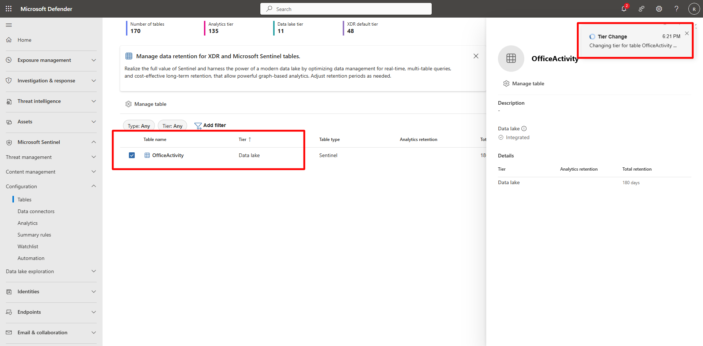

## Task 01: Configure workspace integration and table mirroring 

 

### Introduction 

Sentinel tables support two storage configurations:

- **Analytics tier (with automatic Lake mirroring)**
- **Data lake tier (Lake-only storage)**

These options determine whether a table keeps searchable hot data in Analytics or stores all data exclusively in the Data Lake.
   

You’ll review mirrored tables, adjust tiering for cost optimization, and ensure critical data remains queryable across the analytics and data lake layers. 

 ### Success criteria 

- Key Defender tables (for example, *SecurityIncident*, *SecurityAlert*, *DeviceInfo*, *DeviceProcessEvents*, *EmailEvents*) are mirrored to the Data Lake.   
- Low-priority tables (for example, *CustomFirewall_CL*) configured as **Lake Only**.   

### Key steps:

1. In the Defender portal, on the left menu, go to **Microsoft Sentinel** > **Configuration** > **Tables**. 

    {: .important }
    > This section displays all tables linked to your Sentinel workspace along with their assigned storage tiers: **Analytics**, **Lake**, or **Lake Only**.   

     

1. Review key Defender tables and ensure their **Storage Tier** is set to **Analytics (Mirrored to Lake)** and their **Status** shows **Enabled**: 

    - **`SecurityIncident`**  

    - **`SecurityAlert`**  

    - **`DeviceInfo`**  

    - **`DeviceProcessEvents`** 

    - **`EmailEvents`**   

     

 
1. For lower-priority tables such as **CustomFirewall_CL**, select **Manage table**.   

   1. Change the **Analytic Tier** to **Data lake tier** to reduce analytics costs. 

        {: .warning }
        > Take note of the warning. 
        > 
        > The following content will not be available for tables in lake tier: Analytics rules, Hunting query, Parsers, Playbooks, Watchlist, and Workbook. Any existing content will stop working after changing to lake tier. 

   1. Select **Save** to apply the change.   

   <!--   -->

   <!--   -->
