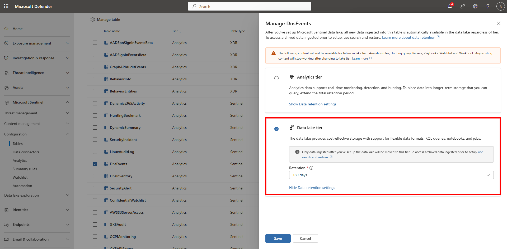

## Task 02: Configure retention policies 

 

### Introduction 

Retention policies define how long Sentinel keeps your data in each storage tier.   

You’ll adjust retention settings for hot (Analytics) and cold (Lake) tiers to align with compliance and cost objectives. 

 

### Success criteria 

- Retention values set and confirmed for at least one Defender table.   

- Analytics and Lake storage policies successfully updated and saved. 

 

1. In the Defender portal, go to **Microsoft Sentinel** > **Configuration** > **Tables**.   

1. Locate the table you want to configure (for example, `SecurityAlert`).   

1. Select the checkbox next to the table and choose **Manage table**.   

1. In the pane that opens, configure the table for **Analytics tier (with Lake mirroring)** by adjusting the **Analytics retention (Hot Storage)** setting.
 
    {: .note } Default: **30 days**
    >
    Up to **90 days** of Analytics retention is included at no additional cost.

   **Recommended:**  
   - Set **90 days** of Analytics retention for all tables that benefit from hot, frequently queried data.
   - Optionally set a **Total retention (Lake Storage)** value (for example, **1 year**) to control how long data is kept in cold storage after it transitions out of Analytics.

1. For **DnsEvents**, configure the table for **Lake-only storage** (Data lake tier).

    {: .note }This mode disables Analytics hot storage and removes capabilities such as analytics rules, hunting queries, watchlists, and workbook support.

1. Under **Total retention (Lake Storage)**, choose an appropriate long-term retention period based on your organization’s needs (for example, **1 year**).

1. Select **Save** to confirm.

    {: .note } After Analytics retention expires—or when a table is configured as Lake-only—data resides exclusively in the Data Lake for long-term retention.  
   No manual “Move to Lake” action is required.

    <!--   -->