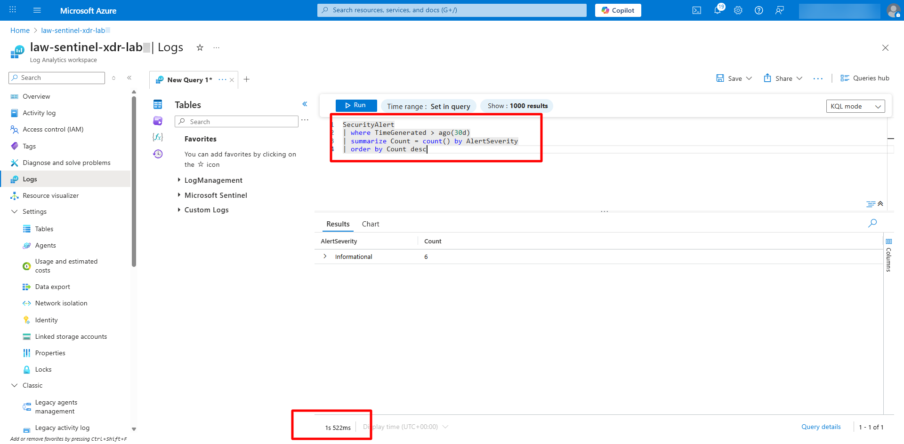
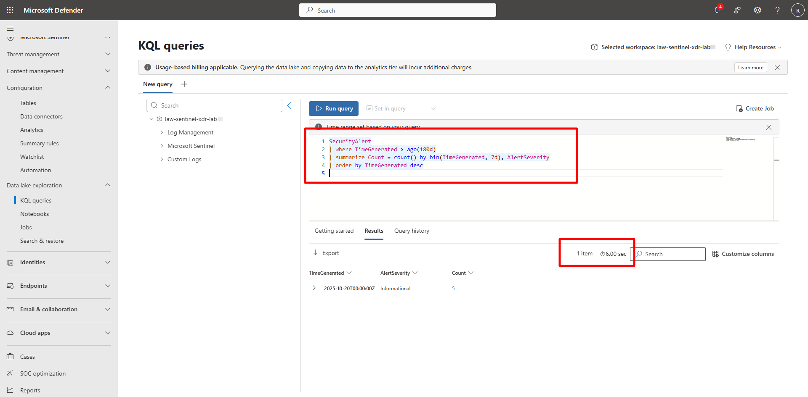

## Task 01: Compare hot vs. cold query performance 

 

### Introduction 

Microsoft Sentinel’s analytics (hot) tier uses a Log Analytics workspace for fast, recent data queries. The Data Lake (cold) tier extends storage for historical analysis and compliance.   

You’ll compare query latency, result counts, and performance between the two tiers. 


### Description 

Run equivalent KQL queries in both tiers to see how data freshness and query depth impact responsiveness. 


### Success criteria 

- Queries execute successfully in both tiers.   
- You observe performance differences between hot and cold storage.   
- You understand which scenarios are best suited for each tier. 

 
### Key steps:

1. Run a query in the analytics (hot) tier. 


    <details markdown="block">  
    <summary>Expand here for detailed steps</summary> 

    1. In the Azure portal, go to **Microsoft Sentinel** > **Logs**.   
    1. Run the following query: 

        ```kusto-wrap
        SecurityAlert 
        | where TimeGenerated > ago(30d) 
        | summarize Count = count() by AlertSeverity 
        | order by Count desc 
        ``` 

    1. Observe fast execution (typically under two seconds).   

        {: .note }
        > This is **hot-tier data** only. 

         

    </details> 

 

1. Run the same query in the Data Lake (cold) tier. 

    <details markdown="block">  
    <summary>Expand here for detailed steps</summary> 

    1. In the Defender portal, go to **Microsoft Sentinel** > **Data Lake Exploration** > **KQL Queries**.   
    1. Run the same query with a longer time window: 

        ```kusto-wrap
        SecurityAlert 
        | where TimeGenerated > ago(180d) 
        | summarize Count = count() by bin(TimeGenerated, 7d), AlertSeverity 
        | order by TimeGenerated desc 
        ``` 

    1. Notice higher latency (10–20 seconds) as the query scans cold storage.   
    1. Compare result counts and time ranges between both tiers.

        

        {: .note }
        > Even with a longer lookback period, the Data Lake may return **the same amount of data or even fewer results** if the workspace or Data Lake integration was recently onboarded. Historical data will only appear once enough time has passed for ingestion and mirroring to accumulate.

    </details> 
