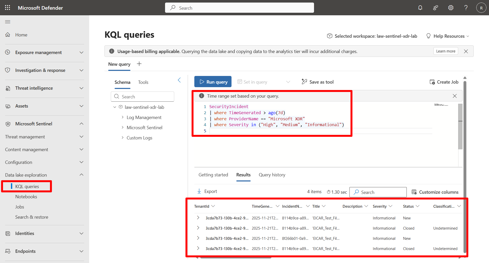
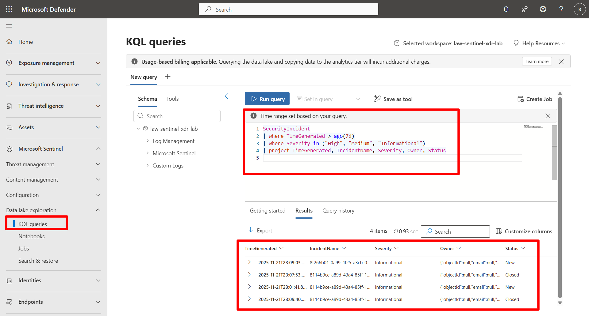
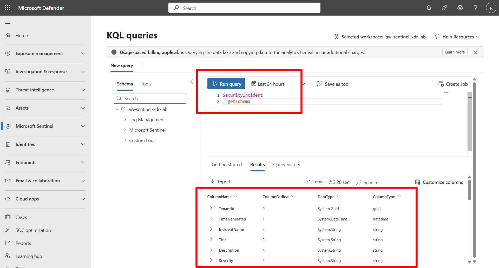
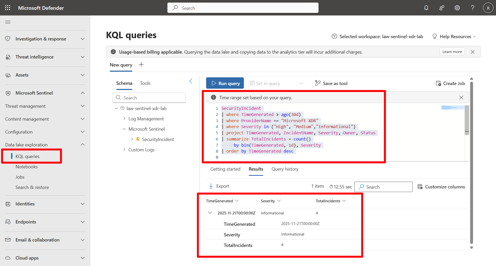

## Task 02: Apply best practices for efficient querying

### Introduction
The Sentinel Data Lake scans large parquet files during query execution. Inefficient KQL can greatly increase scan time, cost, and the likelihood of hitting row or result limits.  
This task introduces core optimization practices that help improve performance, reduce compute overhead, and streamline downstream analysis.

### Description
You will run several queries demonstrating how to restrict the time range, apply selective filters early, project only required columns, discover schema, and use summaries or KQL Jobs for long-range analytics.

### Success criteria
- A tight time filter is applied to reduce scanned data.  
- High-value filters are applied early.  
- Only required fields are projected.  
- `getschema` is used for table exploration.  
- Summaries/KQL Jobs are understood as a pattern for large datasets.


1. Restrict the time range.

    <details markdown="block"> 
    <summary>Expand here for detailed steps</summary>

    {: .important } Large, unbounded time windows force the Lake to scan excessive parquet files. A narrow time filter drastically improves performance.

    1. In the Defender portal, go to **Microsoft Sentinel** > **Data Lake Exploration** > **KQL Queries**.  
    1. Run the following query:

        ```kusto-wrap
        SecurityIncident
        | where TimeGenerated > ago(7d)
        ```

        **Benefits:**  
        - Reduces data scanned  
        - Accelerates execution  
        - Prevents hitting row or result-size limits  

    </details>


1. Filter early on high-value fields.

    <details markdown="block"> 
    <summary>Expand here for detailed steps</summary>

    {: .important }Apply the most selective filters at the top of your query. This reduces the rowset *before* projecting or summarizing.

    1. Run the following query:

        ```kusto-wrap
        SecurityIncident
        | where TimeGenerated > ago(7d)
        | where ProviderName == "Microsoft XDR"
        | where Severity in ("High", "Medium", "Informational")
        ```

        

        **Benefits:**  
        - Removes irrelevant rows immediately  
        - Minimizes downstream processing  
        - Faster & more efficient scanning  

    </details>


1. Project only required columns.

    <details markdown="block"> 
    <summary>Expand here for detailed steps</summary>

    {: .important } By default, KQL returns *all* columns. Explicit projection reduces payload size and makes dashboards clearer.

    1. Run:

        ```kusto-wrap
        SecurityIncident
        | where TimeGenerated > ago(7d)
        | where Severity in ("High", "Medium", "Informational")
        | project TimeGenerated, IncidentName, Severity, Owner, Status
        ```

        

        **Benefits:**  
        - Reduces data volume  
        - Improves readability  
        - Shortens query execution time  

    </details>


1. Use schema discovery before querying.

    <details markdown="block"> 
    <summary>Expand here for detailed steps</summary>

    {: .important }When you are unsure about fields or when tables evolve, use `getschema` to explore the structure.

    1. Run:

        ```kusto-wrap
        SecurityIncident
        | getschema
        ```

        

        **Benefits:**  
        - Confirms field names and types  
        - Prevents errors from missing or renamed columns  
        - Useful when working with Lake tables that change over time  

    </details>


1. For large data ranges, use summaries + KQL Jobs.

    <details markdown="block"> 
    <summary>Expand here for detailed steps</summary>

    {: .important }Directly querying large historical datasets in the Lake (e.g., months or years of parquet files) is inefficient. A better pattern is to generate curated rollups and persist them using KQL Jobs.

    **Use this pattern for long-range analysis:**  
    - Query large data volumes in the Lake  
    - Generate daily or hourly rollups  
    - Save results into an Analytics-tier table using a KQL Job  
    - Query the smaller “gold table” instead of rescanning raw telemetry  

    {: .note }  
    >This pattern is used extensively in **Exercise 7**, where you build both one-off and scheduled KQL Jobs.

    </details>


1. Run the optimized end-to-end example.

    <details markdown="block"> 
    <summary>Expand here for detailed steps</summary>

    {: .important }This query demonstrates all optimization techniques together.

    ```kusto-wrap
    SecurityIncident
    | where TimeGenerated > ago(7d)
    | where ProviderName == "Microsoft XDR"
    | where Severity in ("High", "Medium","Informational")
    | project TimeGenerated, IncidentName, Severity, Owner, Status
    | summarize TotalIncidents = count()
        by bin(TimeGenerated, 1d), Severity
    | order by TimeGenerated desc
    ```

    

    **This reflects the best practices:**  
    - Tight time range  
    - Early filtering  
    - Column projection  
    - Aggregation  

    </details>
