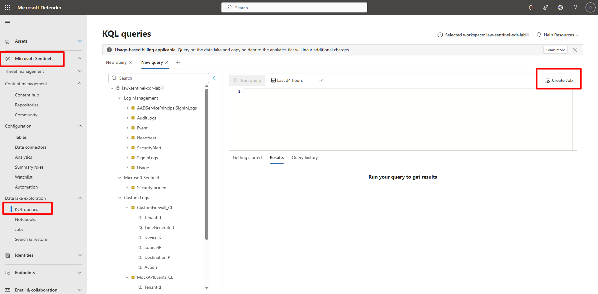
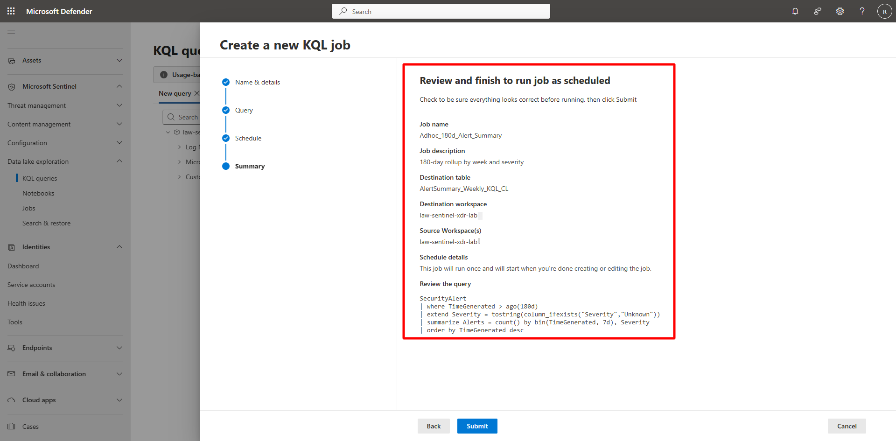
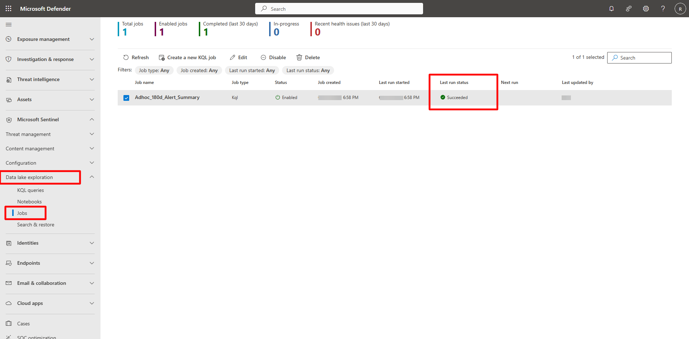
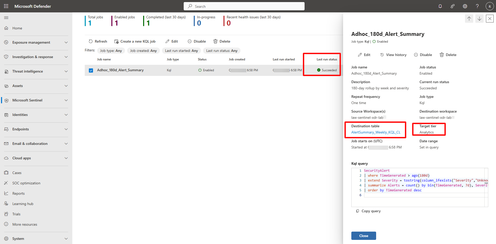
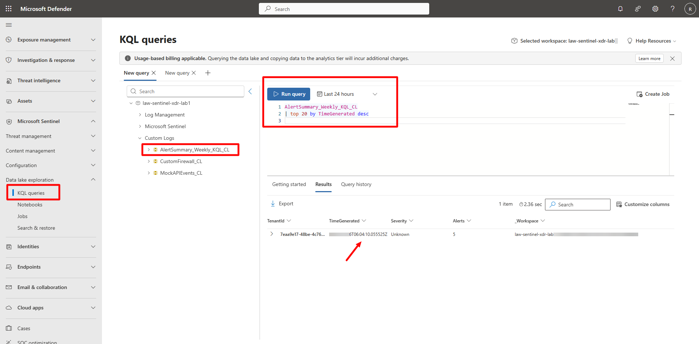

## Task 01: Create a one-off KQL job (ad-hoc large query) 


### Introduction 

A one-off KQL job lets you run high-volume queries once and persist their results so analysts can reuse data without rescanning the Data Lake. 

 

### Description 

You’ll create a new KQL job in Microsoft Sentinel, define its query, and verify the generated results table. 

 
### Success criteria 

- A one-off KQL job named `Adhoc_180d_Alert_Summary` is created.   
- The job completes successfully with status **Succeeded**.   
- Output table `AlertSummary_Weekly_KQL_CL` is queryable in Sentinel. 

### Key steps:

1. In the Defender portal, go to **Microsoft Sentinel** > **Data Lake exploration** > **KQL queries**. 

 
1. In the upper right of the query, select **Create Job**. 

     

    {: .note }
    > The **Create a new KQL job** wizard opens. 

1. Create a new job using the following details: 

 

    <details markdown="block">  
    <summary>Expand here for detailed steps</summary> 

    1. On the Name & details page, enter the following and select **Next**: 

        | Item | Value | 
        |:---------|:---------| 
        | **Job name:**   | `Adhoc_180d_Alert_Summary`   | 
        | **Description:**   | `180-day rollup by week and severity`   | 
        | **Destination workspace:**   | **law-sentinel-xdr-lab**   | 
        | **New table name:**   | `AlertSummary_Weekly_KQL_CL`   |     

    1. On the Query page, define and validate the query by entering the following and select **Next**: 

        ```kusto-wrap
        SecurityAlert 
        | where TimeGenerated > ago(180d) 
        | extend Sev = tostring(column_ifexists("Severity", "Unknown")) 
        | summarize Alerts = count() by bin(TimeGenerated, 7d), Sev 
        | order by TimeGenerated desc 
        ```

        
 

    1. On the Schedule page, configure schedule and limits. 

        - Set **Job frequency** to **One time**.   
        - Review the schedule summary. 

            {: .note }The schedule summary confirms: *This job will run once and start after creation.*   
            > 
            > No additional options are required for one-off jobs.   

              

    1. Select **Next**. 
    
    1. Review the details and select **Submit**. 

         

    </details> 

 

1. Verify job completion. 

    <details markdown="block">  
    <summary>Expand here for detailed steps</summary> 

    1. In the Defender portal, go to **Microsoft Sentinel** > **Data Lake exploration** > **Jobs**.   
    1. Review metrics such as **Total jobs**, **Enabled jobs**, **Completed (last 30 days)**, **In-progress**, and **Recent health issues**.   
    1. Verify your job, **Adhoc_180d_Alert_Summary**, status shows **Succeeded**. 

         

    </details> 

 

1. Review job details. 

    <details markdown="block">  
    <summary>Expand here for detailed steps</summary> 

    1. Select the job to open its details pane.  

    1. Verify these fields:   
        - **Job name:** `Adhoc_180d_Alert_Summary`   
        - **Description:** `180-day rollup by week and severity`   
        - **Repeat frequency:** `One time`   
        - **Destination table:** `AlertSummary_Weekly_KQL_CL`   
        - **Workspace:** `law-sentinel-xdr-lab1`   
        - **Current run status:** `Succeeded`   
        - **Target tier:** `Analytics` 
        - **Kql query:** `Confirm the KQL query is visible for review` 

         

    </details> 

 

1. Explore the job output. 

    <details markdown="block">  
    <summary>Expand here for detailed steps</summary> 

    1. In the Defender portal, go to **Microsoft Sentinel** > **Data Lake exploration** > **KQL queries**. 

    1. Run the following query:  

        ```kusto-wrap
        AlertSummary_Weekly_KQL_CL 
        | top 20 by TimeGenerated desc 
        ``` 

        

    </details> 
