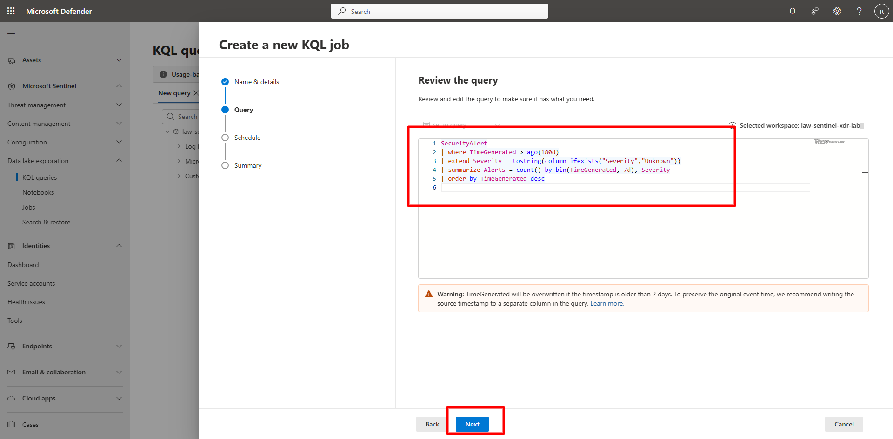
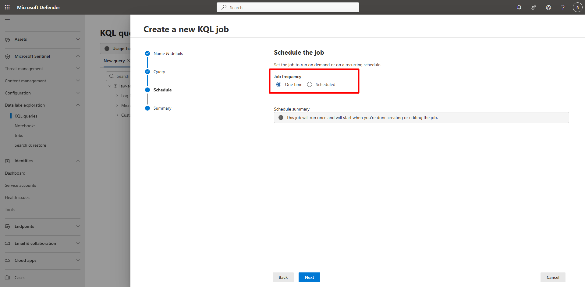
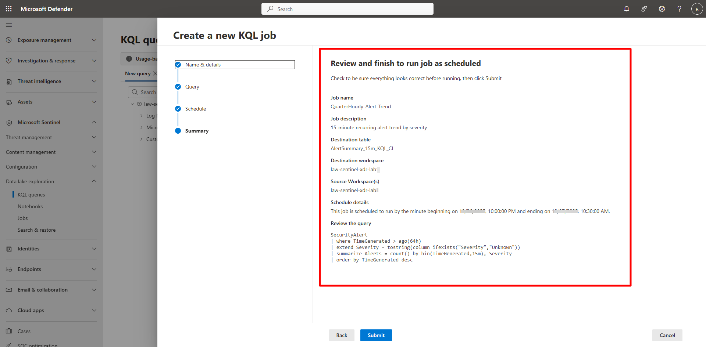
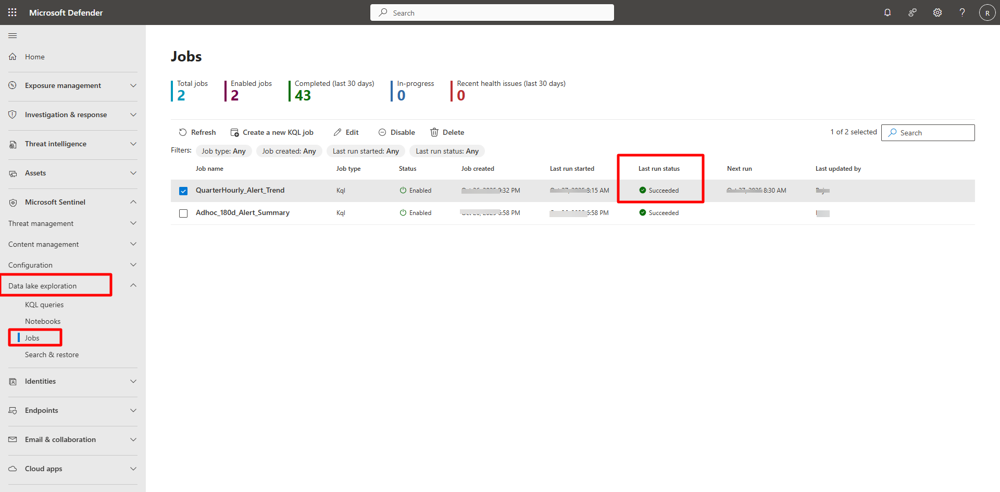
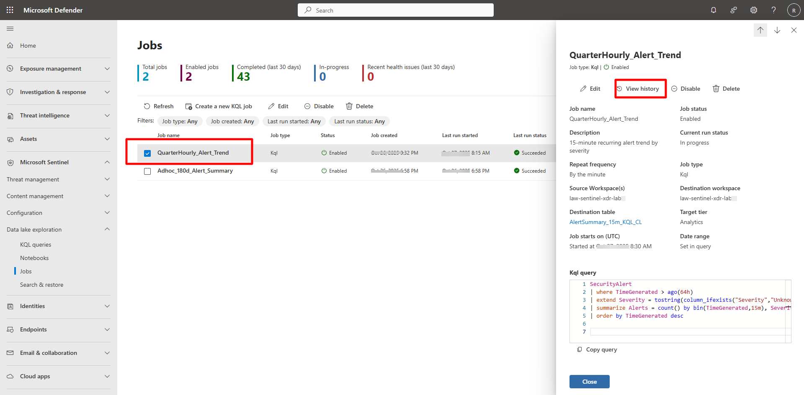
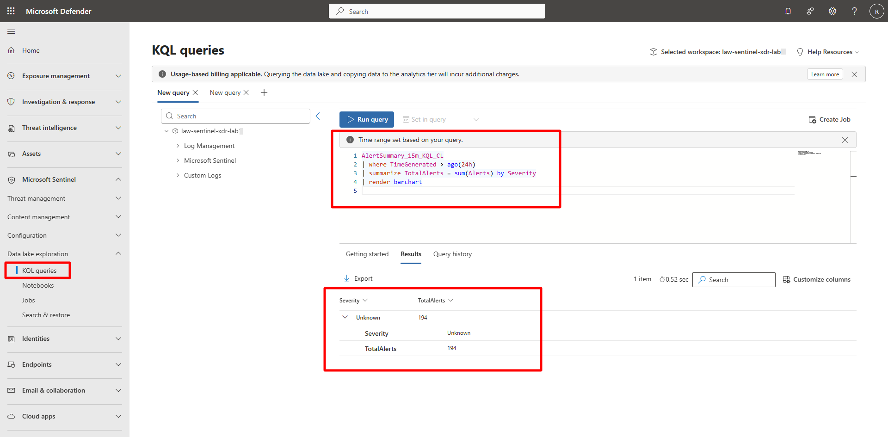

## Task 02: Create a recurring operational job 

 
### Introduction 

Recurring KQL jobs continuously process incoming telemetry for near-real-time analytics or dashboard metrics. 

 
### Description 

You’ll schedule a recurring job that aggregates Security Alert data every 15 minutes by severity. 

 

### Success criteria 

- A recurring KQL job named `QuarterHourly_Alert_Trend` is created and active.   
- The job runs automatically every 15 minutes.   
- Output table `AlertSummary_15m_KQL_CL` is populated and queryable. 

### Key steps:
 

1. Open the KQL job wizard and create a new job with the following details: 


    <details markdown="block">  
    <summary>Expand here for detailed steps</summary> 

    1. In the Defender portal, go to **Microsoft Sentinel** > **Data Lake exploration** > **KQL queries**. 
    1. In the upper right of the query, select **Create job**. 
    1. On the Name & details page, enter the following and select **Next**: 

        | Item | Value | 
        |:---------|:---------| 
        | **Job name:**   | `QuarterHourly_Alert_Trend`   | 
        | **Description:**   | `15-minute recurring alert trend by severity`   | 
        | **Destination workspace:**   | **law-sentinel-xdr-lab**   | 
        | **New table name:**   | `AlertSummary_15m_KQL_CL`   |  


    1. On the Query page, define and validate the query by entering the following and select **Next**: 

        ```kusto-wrap
        SecurityAlert 
        | where TimeGenerated > ago(64h) 
        | extend Severity = tostring(column_ifexists("Severity", "Unknown")) 
        | summarize Alerts = count() by bin(TimeGenerated, 15m), Severity 
        | order by TimeGenerated desc 
        ``` 

         

    1. On the Schedule page, configure schedule and limits. 

        - Set **Job frequency** to **Scheduled**. 
        - Under **Schedule interval**, configure:   
            - **Run every:** 15 minutes   
            - **Start time:** Next quarter-hour mark   
        - Review the schedule summary. 
        {: .note }The schedule summary confirms: *The job runs every 15 minutes.*

         

    1. Select **Next**. 
    
    1. Verify the details and select **Submit**. 

        - **Job name:** `QuarterHourly_Alert_Trend`   
        - **Destination table:** `AlertSummary_15m_KQL_CL`   
        - **Workspace:** `law-sentinel-xdr-lab1`   
        - **Frequency:** Every 15 minutes   
        - **Query:** Your validated KQL 

    1. Select **Done**. 

        
        
    </details> 

 

1. Verify recurring job execution. 

    <details markdown="block">  
    <summary>Expand here for detailed steps</summary> 

    1. In the Defender portal, go to **Microsoft Sentinel** > **Data Lake exploration** > **Jobs**.   
    1. Confirm metrics such as **Total jobs**, **Enabled jobs**, and **Completed**.   
    1. Verify **QuarterHourly_Alert_Trend**, status should show **Succeeded** after 15 minutes. 

        
  

    1. To view history, open the job pane and select **View history**. 

        

    </details> 

 
1. Explore the job output. 

 
    <details markdown="block">  
    <summary>Expand here for detailed steps</summary> 

    1. In the Defender portal, go to **Microsoft Sentinel** > **Data Lake exploration** > **KQL queries**. 

    1. Run the following query: 

        ```kusto-wrap
        AlertSummary_15m_KQL_CL 
        | where TimeGenerated > ago(24h) 
        | summarize TotalAlerts = sum(Alerts) by Severity 
        | render barchart 
        ``` 

         

    </details> 
