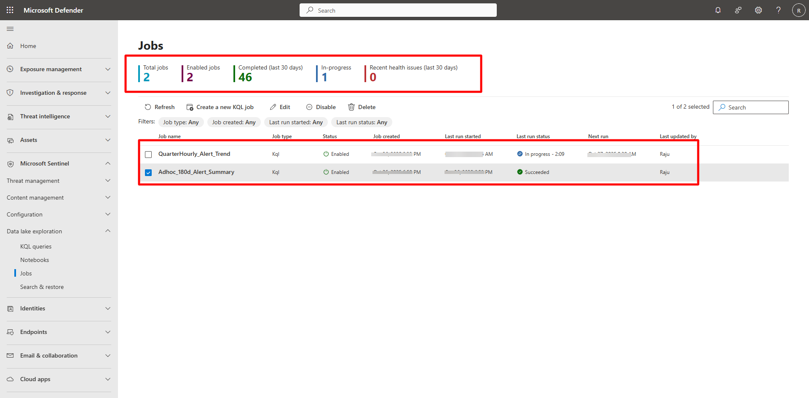

## Task 03: Monitor job execution 

 
### Introduction 

Monitoring job status helps ensure scheduled analytics complete successfully and data stays current. 

### Description 

You’ll verify job status, view run history, and confirm completion details. 

 

### Success criteria 

- Job status = Enabled   
- Last run status = Succeeded   
- History shows start and end times 

---

1. In the Defender portal, go to **Microsoft Sentinel** > **Data Lake exploration** > **Jobs**. 

1. Confirm:   

   - **Status:** Enabled   
   - **Last run status:** Succeeded 

 
1. Select the job and then select **View history** to verify start/end time and duration. 

 

 
--- 

**Additional references** 

- [Manage KQL jobs in Microsoft Sentinel Data Lake](https://learn.microsoft.com/en-us/azure/sentinel/datalake/kql-manage-jobs)   

- [Troubleshoot KQL job issues](https://learn.microsoft.com/en-us/azure/sentinel/datalake/kql-troubleshoot) 

 