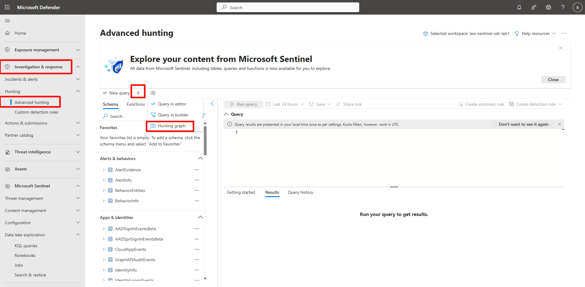
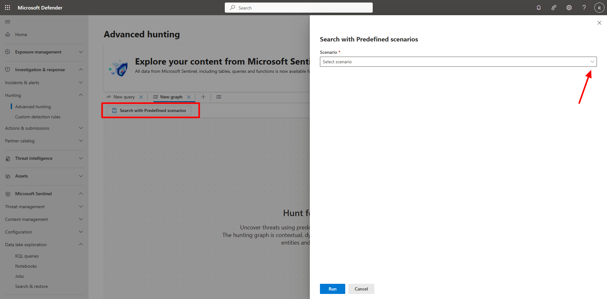
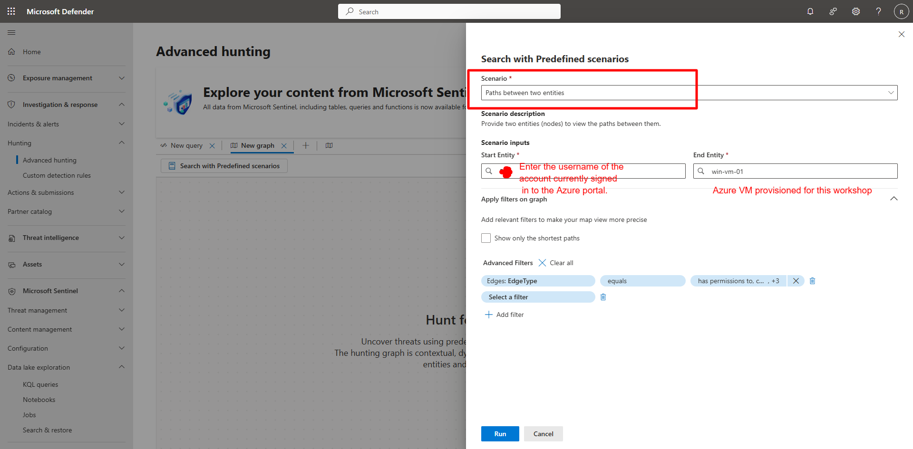
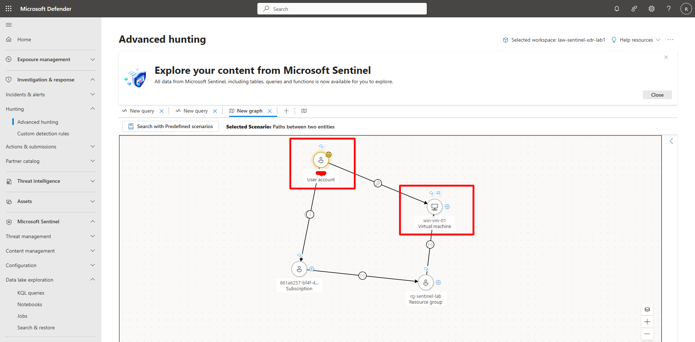
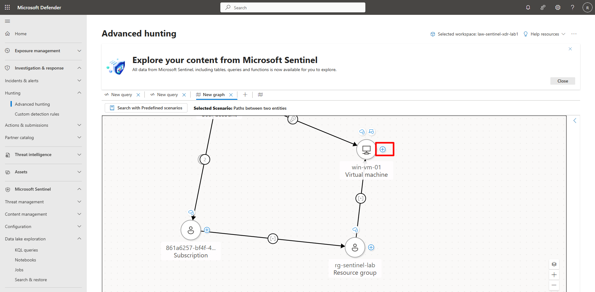
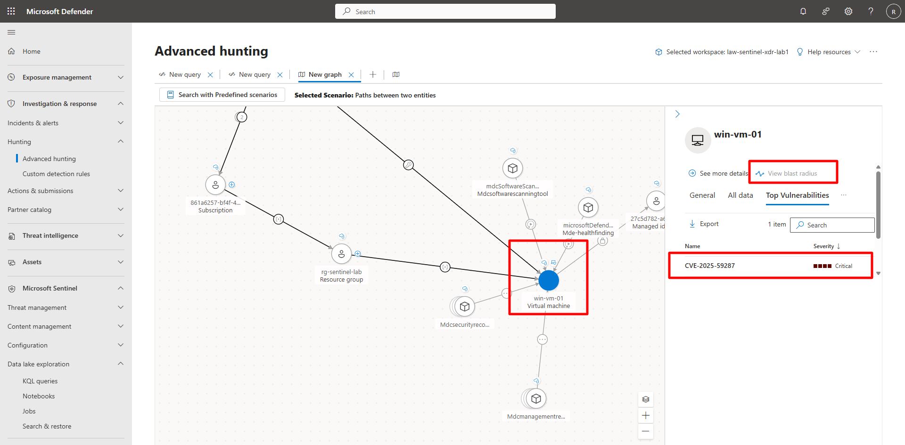

## Task 01: Use hunting graph visualization 

 
### Introduction 

The graph visualization feature in Microsoft Defender XDR reveals relationships between users, devices, and IPs. It helps analysts uncover lateral movement, correlated alerts, and entity dependencies. 

### Description 

You’ll open the hunting graph tool, load a scenario, and interactively explore how different entities connect through logon, process, and network relationships. 

 

### Success criteria 

- The **Paths between two entities** graph renders successfully.   
- Entity nodes and relationships display with proper labels.   
- The analyst identifies at least one potential lateral movement path. 

### Key steps:

1. Open the graph visualization tool and select the **Render graph** predefined scenario. 

 
    
  

    
Expand here for detailed steps
 

    1. In the Defender portal, go to **Investigation & response** > **Hunting** > **Advanced hunting**.   
    1. On the menu, select the **+**, then select **Hunting graph**. 
    1. Select **Search with Predefined scenarios**. 
    1. Enter the following and select **Run**: 

        | Item | Value | 
        |:---------|:---------| 
        | **Scenario**   | `Paths between two entities`  | 
        | **Start Entity**   | `Current Azure account you are signed in with`   | 
        | **End Entity**   | `vm-sentinel-lab`   | 

 

     

     

     

    
 

 

1. Explore the graph. 

    - **Nodes** represent entities such as users, devices, and IP addresses.   

    - **Edges** represent relationships like logons, processes, or network connections.   

    - Use zoom and pan controls to navigate the graph, and expand nodes for detailed context. 

 

 

{: .important }
> Use the graph to visualize blast radius and lateral movement potential—how compromise of one device could spread to others.   

 

 
