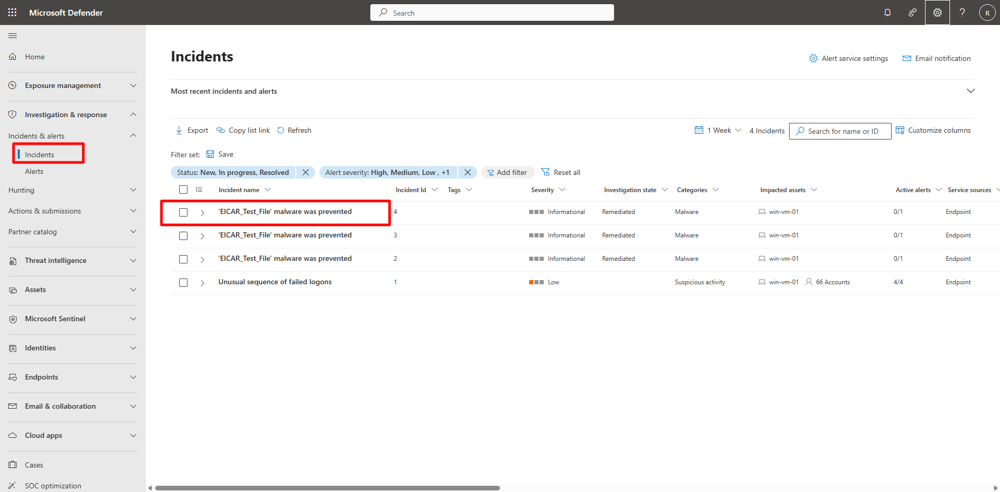
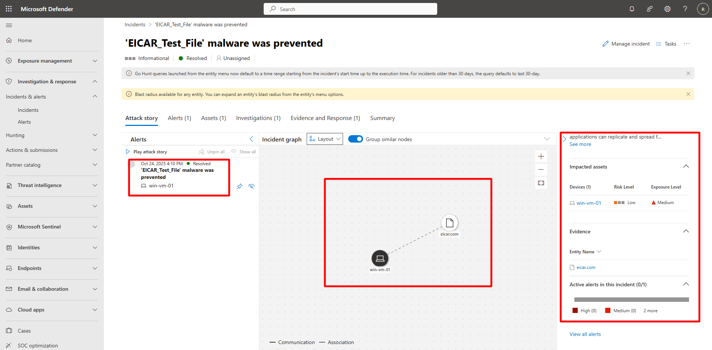
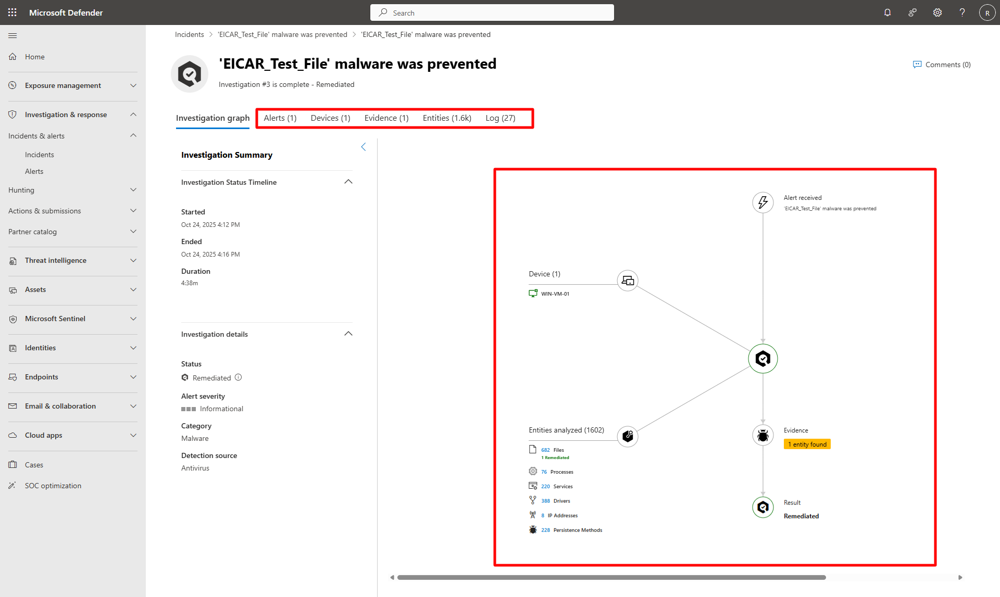

## Task 02: Explore the Entity Investigation Graph 

 

### Introduction 

The Entity Investigation Graph helps visualize all entities, alerts, and relationships associated with a specific incident in Defender XDR. 

 

### Description 

You’ll analyze the EICAR test alert triggered from your Azure VM to review related entities and attack paths using the built-in investigation graph. 

 

### Success criteria 

- The **EICAR_Test_File malware was prevented** incident is visible.   

- Related entities appear in the investigation graph.   

- You understand how Defender XDR automatically correlates evidence and relationships. 

1. Locate the EICAR incident. 

    
  
    
Expand here for detailed steps
 

    1. In the Defender portal, go to **Investigation & response > Incidents & Alerts > Incidents**.   
    1. Apply filters:   
        - **Status:** New, In progress, Resolved   
        - **Alert severity:** High, Medium, Low, Informational   
    1. Locate the incident titled **EICAR_Test_File malware was prevented**.   
    1. Confirm:   
        - **Category:** Malware   
        - **Impacted asset:** Your test VM (for example, `win-vm-01`). 

    
 

 

1. Investigate incident details. 

    
  
    
Expand here for detailed steps
 

    1. Select the **EICAR_Test_File** incident. 

    1. Review the incident details page— the **Incident graph** appears in the center panel. 

             
          

    1. Open the **Investigations** tab and select the triggering alert to view the **Investigation graph**. 

    1. Explore the **Evidence**, **Entities**, and **Logs** tabs for correlated artifacts and automated analysis results. 

         

    
 
