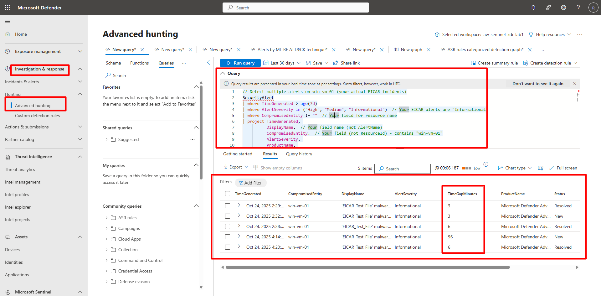

## Task 03: Analyze EICAR nciidents using Advanced Hunting 

 

### Introduction 

Advanced Hunting enables deep correlation of Defender XDR alerts and Sentinel telemetry using KQL. You’ll run a custom query to analyze multiple related EICAR alerts. 

 

### Description 

You’ll use Advanced Hunting to identify patterns in Defender alerts generated from the simulated EICAR malware test and validate relationships by entity and time. 

 

### Success criteria 

- The query runs successfully and returns related alerts.   
- Correlated incidents for the same VM are displayed with time gaps under three hours. 

 ### Key steps:

1. Open Advanced Hunting and run the correlation query.

    <details markdown="block">  
    <summary>Expand here for detailed steps</summary> 

    1. In the Defender portal, go to **Investigation & Response** > **Hunting** > **Advanced hunting**.   
    1. Confirm your workspace context matches your Sentinel workspace (for example, `law-sentinel-xdr-lab`).   
    1. Select **+ New query** and run the following:   
    
        ```kusto-wrap
        // Detect multiple alerts on win-vm-01 (EICAR incidents) 
        SecurityAlert 
        | where TimeGenerated > ago(7d) 
        | where AlertSeverity in ("High", "Medium", "Informational")  // EICAR alerts appear as Informational 
        | where CompromisedEntity != ""  // Field for the impacted resource 
        | project TimeGenerated, 
                  DisplayName, 
                  CompromisedEntity, 
                  AlertSeverity, 
                  ProductName, 
                  SystemAlertId, 
                  Status, 
                  VendorOriginalId, 
                  ProviderName 
        | order by CompromisedEntity asc, TimeGenerated asc 
        | extend PrevEntity = prev(CompromisedEntity, 1) 
        | extend PrevTime = prev(TimeGenerated, 1) 
        | where CompromisedEntity == PrevEntity 
        | extend TimeGapMinutes = datetime_diff('minute', TimeGenerated, PrevTime) 
        | where TimeGapMinutes <= 180 
        | project CompromisedEntity, 
                  DisplayName, 
                  AlertSeverity, 
                  TimeGenerated, 
                  TimeGapMinutes, 
                  ProductName, 
                  Status, 
                  SystemAlertId 
        ``` 

         

    </details> 

 

{: .note }
> In the results, verify that multiple alerts reference the same **CompromisedEntity** and appear within three hours of each other.   
