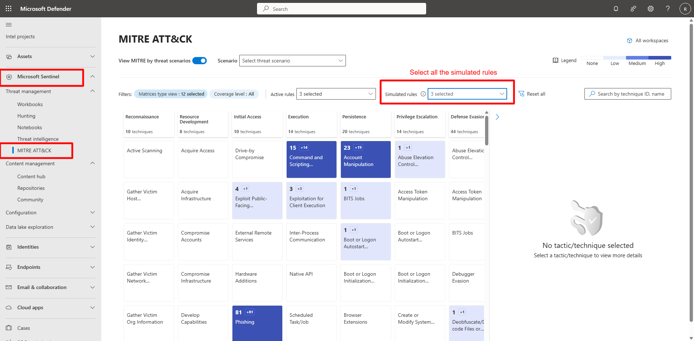
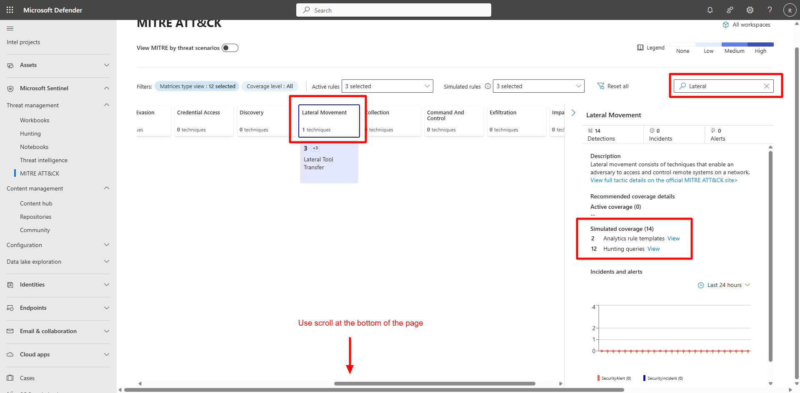
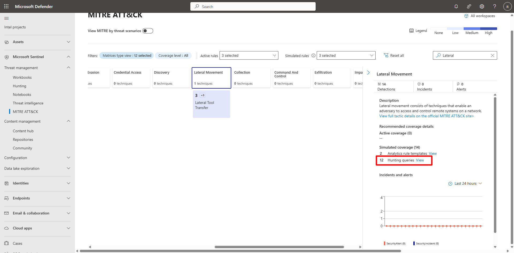
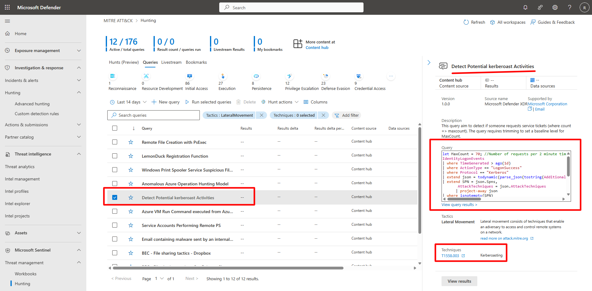
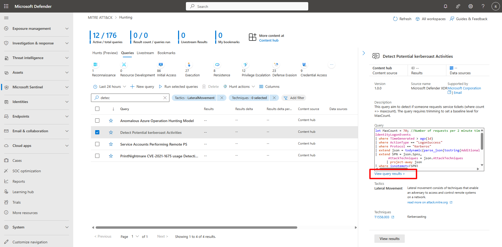
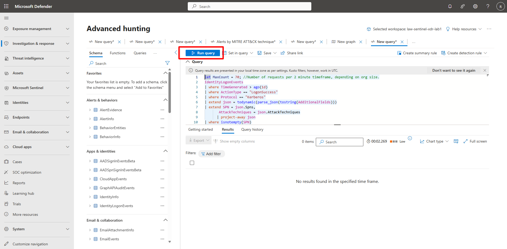

## Task 04: Hunt with built-in queries and MITRE ATT&CK 

### Introduction 

Microsoft Defender XDR integrates hunting queries with the MITRE ATT&CK matrix, mapping telemetry and detections to tactics and techniques. 

 

### Description 

You’ll access the MITRE ATT&CK matrix, explore mapped techniques, and execute prebuilt hunting queries. 

 

### Success criteria 

- The MITRE ATT&CK matrix loads successfully.   

- You identify a lateral movement technique.   

- A built-in hunting query executes successfully. 

 

1. Access the MITRE ATT&CK view. 

 

    
  
    
Expand here for detailed steps
 

    1. In the Defender portal, go to **Microsoft Sentinel** > **Threat management** > **MITRE ATT&CK**.   
    1. Review the matrix display showing mapped detections across tactics.   
    1. Confirm filters:   
        - **Matrix type view:** Default (12 selected)   
        - **Coverage level:** All   
        - **Active rules:** 3 selected   
        - **Simulated rules:** 3 selected 

         

    
 

 

1. Explore lateral movement techniques. 

    
  
    
Expand here for detailed steps
 

    1. In the search box, enter `Lateral` and select **Enter**. 

         

    1. Select **View Hunting Queries**. 

         

    1. Choose a technique (for example, **Detect Potential Kerberoast Activities**) to open its details pane. 

    1. Review analytic rules, detections, and entities. 

    1. Select **View Query Results** to run the associated hunting query. 

     
     
     

    
 