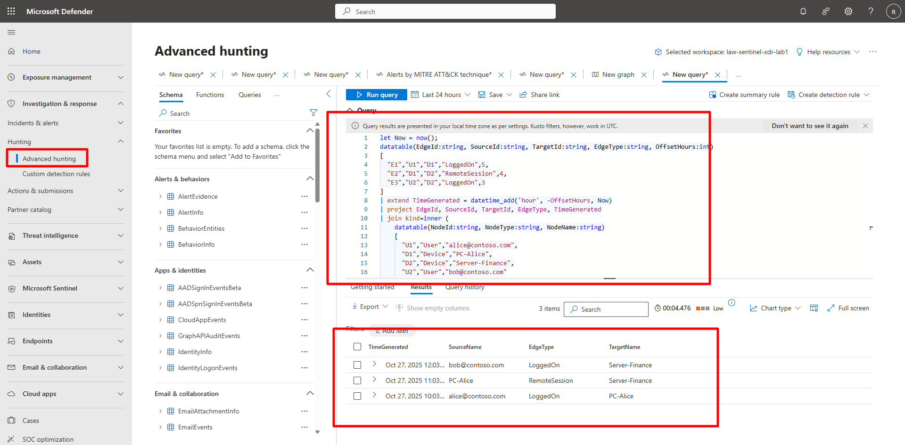

## Task 05: Hunt for lateral movement with graph-semantic KQL 

 

### Introduction 

Graph-semantic KQL queries allow you to define entities and their relationships directly in query logic—ideal for visualizing lateral movement. 

 

### Description 

You’ll simulate a small graph dataset and visualize how user and device relationships can indicate attacker movement. 

 

### Success criteria 

- A graph query runs successfully.   

- Results show clear Source–Target entity relationships. 


1. Run a graph-semantic query. 

    <details markdown="block">  
    <summary>Expand here for detailed steps</summary> 

    ```kusto-wrap
    let Now = now(); 
    datatable(EdgeId:string, SourceId:string, TargetId:string, EdgeType:string, OffsetHours:int) 
    [ 
      "E1","U1","D1","LoggedOn",5, 
      "E2","D1","D2","RemoteSession",4, 
      "E3","U2","D2","LoggedOn",3 
    ] 
    | extend TimeGenerated = datetime_add('hour', -OffsetHours, Now) 
    | project EdgeId, SourceId, TargetId, EdgeType, TimeGenerated 
    | join kind=inner ( 
        datatable(NodeId:string, NodeType:string, NodeName:string) 
        [ 
          "U1","User","alice@contoso.com", 
          "D1","Device","PC-Alice", 
          "D2","Device","Server-Finance", 
          "U2","User","bob@contoso.com" 
        ] 
        | project NodeId, SourceName = NodeName 
    ) on $left.SourceId == $right.NodeId 
    | join kind=inner ( 
        datatable(NodeId:string, NodeType:string, NodeName:string) 
        [ 
          "U1","User","alice@contoso.com", 
          "D1","Device","PC-Alice", 
          "D2","Device","Server-Finance", 
          "U2","User","bob@contoso.com" 
        ] 
        | project NodeId, TargetName = NodeName 
    ) on $left.TargetId == $right.NodeId 
    | project SourceName, EdgeType, TimeGenerated, TargetName 
    | order by TimeGenerated desc 
    ``` 

     

    {: .important }This query builds mock *Edges* and *Nodes* tables, joining them twice to display meaningful relationships between users and devices. 

    </details> 