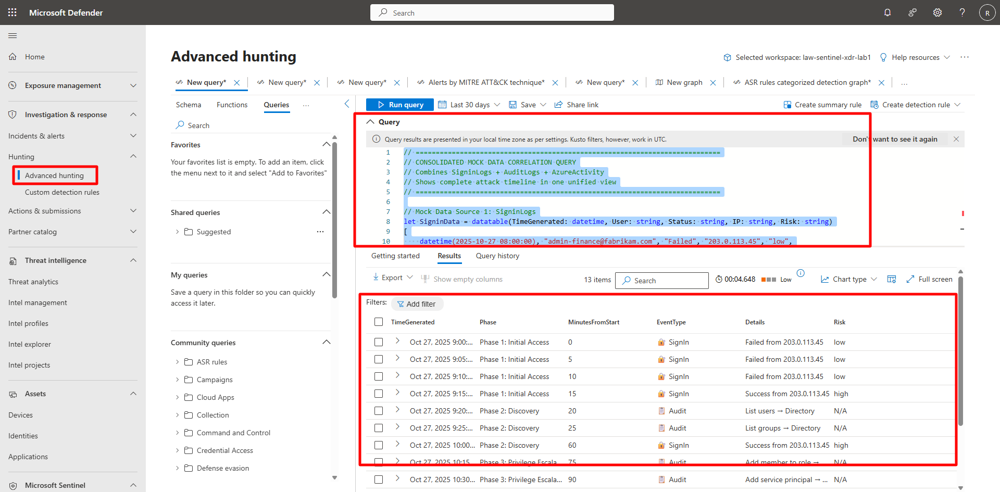

## Task 06: Build and analyze a simulated attack timeline 

 

### Introduction 

You’ll correlate mock telemetry data from multiple tables (SigninLogs, AuditLogs, and AzureActivity) to simulate and visualize a complete attack sequence. 

 

### Description 

This exercise demonstrates how to correlate data sources using KQL to build a unified, MITRE-style attack timeline. 

 

### Success criteria 

- Consolidated correlation query executes successfully.   

- Attack timeline phases appear in chronological order.   

- Query output displays risk escalation. 

 

1. Open Advanced Hunting and execute the consolidated correlation query. 

    <details markdown="block">  
    <summary>Expand here for detailed steps</summary> 

    1. In the Defender portal, go to **Investigation & Response** > **Hunting** > **Advanced Hunting**.   
    1. Verify your workspace context matches your Sentinel workspace (for example, `law-sentinel-xdr-lab1`).   
    1. Select **+ New query** and run the following:   
    
        ```kusto-wrap
        // ============================================================================  
        // CONSOLIDATED MOCK DATA CORRELATION QUERY 
        // Combines SigninLogs + AuditLogs + AzureActivity 
        // Shows complete attack timeline in one unified view 
        // ============================================================================ 
        let SigninData = datatable(TimeGenerated: datetime, User: string, Status: string, IP: string, Risk: string) 
        [ 
            datetime(2025-10-27 08:00:00), "admin-finance@fabrikam.com", "Failed", "203.0.113.45", "low", 
            datetime(2025-10-27 08:05:00), "admin-finance@fabrikam.com", "Failed", "203.0.113.45", "low", 
            datetime(2025-10-27 08:10:00), "admin-finance@fabrikam.com", "Failed", "203.0.113.45", "low", 
            datetime(2025-10-27 08:15:00), "admin-finance@fabrikam.com", "Success", "203.0.113.45", "high", 
            datetime(2025-10-27 09:00:00), "admin-finance@fabrikam.com", "Success", "203.0.113.45", "high" 
        ] 
        | extend EventType = "🔐 SignIn", Details = strcat(Status, " from ", IP); 
        let AuditData = datatable(TimeGenerated: datetime, User: string, Operation: string, Target: string) 
        [ 
            datetime(2025-10-27 08:20:00), "admin-finance@fabrikam.com", "List users", "Directory", 
            datetime(2025-10-27 08:25:00), "admin-finance@fabrikam.com", "List groups", "Directory", 
            datetime(2025-10-27 09:15:00), "admin-finance@fabrikam.com", "Add member to role", "Contributor", 
            datetime(2025-10-27 09:30:00), "admin-finance@fabrikam.com", "Add service principal", "DataAccess-App" 
        ] 
        | extend EventType = "📋 Audit", Details = strcat(Operation, " > ", Target); 
        let AzureData = datatable(TimeGenerated: datetime, User: string, Operation: string, Resource: string) 
        [ 
            datetime(2025-10-27 09:45:00), "admin-finance@fabrikam.com", "LIST_KEY_VAULTS", "subscription-resources", 
            datetime(2025-10-27 10:00:00), "admin-finance@fabrikam.com", "READ_SECRET", "DatabasePassword", 
            datetime(2025-10-27 10:05:00), "admin-finance@fabrikam.com", "READ_SECRET", "StorageKey", 
            datetime(2025-10-27 10:10:00), "admin-finance@fabrikam.com", "READ_SECRET", "ApiToken" 
        ] 
        | extend EventType = "☁️ Azure", Details = strcat(Operation, " > ", Resource); 
        SigninData | project TimeGenerated, EventType, Details, Risk 
        | union (AuditData | project TimeGenerated, EventType, Details, Risk = "N/A") 
        | union (AzureData | project TimeGenerated, EventType, Details, Risk = "N/A") 
        | order by TimeGenerated asc 
        | extend MinutesFromStart = datetime_diff('minute', TimeGenerated, datetime(2025-10-27 08:00:00)) 
        | extend Phase = case( 
            MinutesFromStart <= 15, "Phase 1: Initial Access", 
            MinutesFromStart <= 60, "Phase 2: Discovery", 
            MinutesFromStart <= 90, "Phase 3: Privilege Escalation", 
            "Phase 4: Credential Access" 
        ) 
        | project Phase, TimeGenerated, MinutesFromStart, EventType, Details, Risk
        ``` 

         

    </details>


1. Interpret the timeline. 

    <details markdown="block">  
    <summary>Expand here for detailed steps</summary> 

    1. Observe how the attack progresses through **Initial Access → Discovery → Privilege Escalation → Credential Access**. 

    1. Note correlation between sign-in attempts, role assignments, and secret access. 

    1. Review the **Risk** column for escalation from *low* to *high*. 

    </details> 
